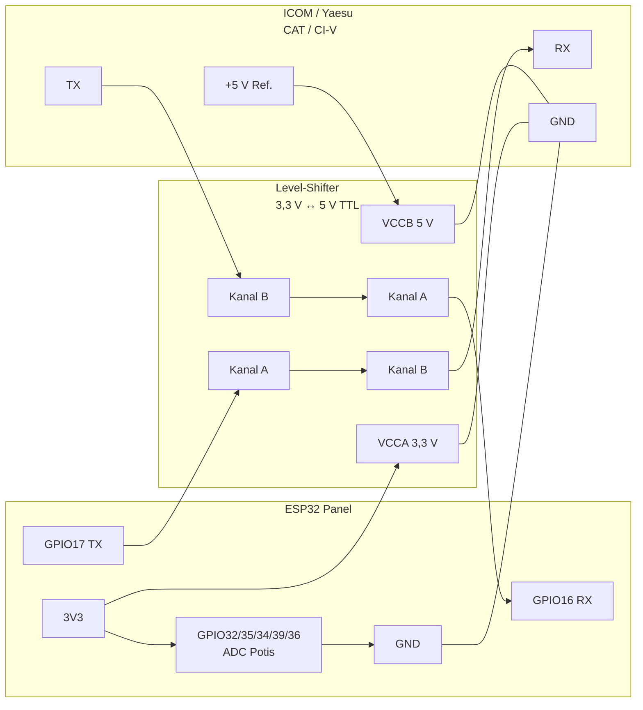

# ESP32 CAT Remote Panel

ESP32-basiertes Funkfernbedienungs-Panel mit Touch-Display, 5 programmierbaren Potentiometern, universeller **ICOM CI-V** / **Yaesu CAT**-Steuerung und optionaler **Audio-Bridge** (Empfang/Mikrofon des Funkgeräts über WiFi). Kompatibel mit **[flrig](https://github.com/w1hkj/flrig)** und **[Hamlib rigctld](https://hamlib.sourceforge.net/html/rigctld.1.html)** über das standardisierte rigctl-TCP-Protokoll (Port 4532).

## Architektur

```
┌─────────────┐   WiFi/TCP:4532    ┌──────────────┐     I2S      ┌─────────┐
│ flrig/fldigi│◄──────────────────►│   ESP32      │◄────────────►│ Funk    │
│ WSJT-X etc. │   rigctl           │  rigctld     │   CAT UART   │ ICOM /  │
└─────────────┘                    │  Audio-UDP   │              │ YAESU   │
       ▲                           │  :4533/4534  │              └─────────┘
       │  optional                 └──────┬───────┘
       │  PCM 16 kHz mono                │ LVGL / Potis
┌──────┴──────┐                          │
│ PC / Browser│  UDP oder WebSocket /ws/audio
└─────────────┘
```

### Betriebsmodi

| Modus | Beschreibung |
|-------|-------------|
| **DIRECT_CAT** (Standard) | ESP32 steuert das Funkgerät direkt per UART |
| **Client → flrig** | ESP32 als rigctl-Client zu PC mit flrig (Modell 4, Port 12345) |
| **Client → rigctld** | ESP32 als Client zu Hamlib rigctld auf dem PC |

## Hardware

### Empfohlen: ESP32-2432S028 (Cheap Yellow Display)

| Funktion | GPIO |
|----------|------|
| CAT RX | 16 |
| CAT TX | 17 |
| I2S BCLK / LRCK | 26 / 25 |
| I2S DOUT (→ DAC, Mic-In) | 22 |
| I2S DIN (← ADC, Line-Out) | 4 |
| Poti 1–5 | 32, 35, 34, 39, 36 |
| Display/Touch | onboard (ILI9341 + XPT2046) |

GPIO33 ist auf dem CYD **Touch-CS** – nicht als Poti belegen (siehe `include/config.h`).

### Schaltplan (Übersicht)



### CAT-Schnittstelle (TTL, kein MAX3232)

Die Firmware nutzt **3,3-V-TTL-UART** (`SERIAL_8N1`). Moderne ICOM- und Yaesu-CAT-Anschlüsse sind **5-V-TTL**, nicht RS-232 (±12 V).

| Schnittstelle | Spannung / Logik | Für dieses Projekt |
|---------------|------------------|--------------------|
| ICOM CI-V, Yaesu CAT (typisch) | 5-V-TTL, 8N1 | **Level-Shifter** 3,3 V ↔ 5 V |
| Echter RS-232 (DE-9, ± Pegel) | RS-232 | **MAX3232** o. Ä. – nur wenn das Funkgerät wirklich RS-232 liefert |
| USB-CAT-Adapter am PC | USB → TTL im Adapter | Nicht zwischen ESP32 und Funkgerät |

**MAX3232 ist nicht vorgesehen**, solange der CAT-Port des Funkgeräts TTL ist (Standard bei IC-7300, FTdx-Serie, u. a.). Ein MAX3232 würde bei TTL-CAT die Pegel falsch wandeln und die Kommunikation stören.

#### Verdrahtung Level-Shifter (z. B. TXS0108E, 2 Kanäle)

```
                    Level-Shifter (bidirektional)
                    ┌─────────────────────────────┐
  ESP32 3V3 ────────┤ VCCA                        │
  Funk  +5V ────────┤ VCCB   (Referenz vom Radio │
  gemeinsam GND ────┤ GND    oder 5V-Regler)    │
                    │                             │
  GPIO17 TX ────────┤ A1 ─────────── B1 ─────────┼──► Funk RX
  GPIO16 RX ◄───────┤ A2 ─────────── B2 ◄────────┼──── Funk TX
                    └─────────────────────────────┘

  ESP32 GND ─────────────── gemeinsam ───────────── Funk GND
```

| Signal | ESP32 (3,3 V) | Shifter | Funkgerät (5 V TTL) |
|--------|---------------|---------|---------------------|
| Senden | GPIO17 → A1 | B1 → | CAT **RX** |
| Empfangen | GPIO16 ← A2 | B2 ← | CAT **TX** |
| Masse | GND | GND | GND |

**Hinweise:**

- TX/RX **kreuzen**: ESP-TX → Funk-RX, ESP-RX ← Funk-TX.
- Nur **ein** GND zwischen Panel, Shifter und Funkgerät; lange gemeinsame Masseleitung vermeiden.
- Baudrate in der Web-UI wählen: ICOM meist **19200**, Yaesu meist **38400** (modellabhängig).
- 3,3-V-TTL-CAT (selten): Shifter optional; Radio-Datenblatt prüfen, ob 3,3 V tolerant ist.

#### RS-232 nur bei Bedarf (Sonderfall)

```
ESP32 GPIO17/16 ──► MAX3232 TTL-Seite ──► DE-9 RS-232 ──► Funk/Adapter (RS-232)
```

Nur verwenden, wenn der Hersteller ausdrücklich einen **RS-232**-CAT-Port dokumentiert. Die Firmware bleibt unverändert; nur die Hardware wandelt die Pegel.

### Potentiometer (5×)

```
        3V3
         │
    ┌────┴────┐
   ╱           ╲
  │  10 kΩ     │  Poti (Bourns/trimmer o. ä.)
  │            │
  └─────┬──────┘
        │
        ├────────────► GPIO (ADC, siehe Pin-Tabelle)
        │
       GND
```

| Poti | CYD (`esp32-cyd`) | T-Display (`esp32-tdisplay`) |
|------|-------------------|------------------------------|
| 1 | GPIO32 | GPIO32 |
| 2 | GPIO35 | GPIO33 |
| 3 | GPIO34 | GPIO25 |
| 4 | GPIO39 | GPIO26 |
| 5 | GPIO36 | GPIO34 |

- Widerstandswert **10 kΩ** (typisch), Mittelabgriff an GPIO, Außen an **3,3 V** und **GND**.
- Nur **3,3 V** am ADC – nie 5 V direkt an GPIO.
- Entstörung optional: **100 nF** von Mittelabgriff nach GND, nah am Poti.

### Stückliste (Minimum)

| Stück | Wert / Typ | Anzahl | Anmerkung |
|-------|------------|--------|-----------|
| ESP32-2432S028 (CYD) oder TTGO T-Display | – | 1 | siehe `platformio.ini` |
| Level-Shifter | TXS0108E, BSS138-Modul o. ä. | 1 | 2 Kanäle für TX/RX |
| Potentiometer | 10 kΩ, linear | 5 | |
| Kabel | abgeschirmt, kurz | – | CAT: TX/RX/GND |
| Optional | 100 nF Keramik | 5 | ADC-Entstörung |

### Gesamtverdrahtung (CYD)

```
┌────────────────── ESP32-2432S028 (CYD) ──────────────────┐
│  USB 5V → Onboard-Regler → 3V3                            │
│  Display/Touch: onboard                                   │
│  GPIO32,35,34,39,36 ←── 5× Poti (3V3–Mitte–GND)          │
│  GPIO17 TX, GPIO16 RX ── Level-Shifter ── Funk CAT       │
│  GND ───────────────────────────────────── Funk GND      │
└──────────────────────────────────────────────────────────┘
```

## Software bauen & flashen

### Web Flasher (empfohlen für Einsteiger)

Firmware **ohne PlatformIO** per USB aus dem Browser installieren ([ESP Web Tools](https://esphome.github.io/esp-web-tools/)):

| Variante | Voraussetzung |
|----------|----------------|
| **GitHub Pages** | Repository → Settings → Pages → Source: *GitHub Actions*. Danach: `https://<user>.github.io/<repo>/` (Workflow `Web Flasher`) |
| **Lokal** | Einmal bauen, dann lokalen Server starten |

```bash
./scripts/build_flasher_assets.sh   # alle Board-Varianten bauen (~3× Build)
./scripts/serve_flasher.sh          # http://127.0.0.1:8765/
```

Im Browser (Chrome / Edge / Firefox, **kein** Safari/iOS):

1. Board wählen (CYD / T-Display / Generic)
2. **Firmware installieren** → USB-Port wählen
3. Optional: Standard-`config.json` per LittleFS mitflashen (Checkbox)

Bei Upload-Fehlern: **BOOT** gedrückt halten, **RESET**, BOOT loslassen, erneut flashen.

### PlatformIO (Entwickler)

Voraussetzungen: [PlatformIO](https://platformio.org/)

```bash
# Python venv einrichten (empfohlen)
python3 -m venv .venv
source .venv/bin/activate
pip install platformio

# CYD-Board (Standard)
pio run -e esp32-cyd -t upload

# Generisches ILI9341-Board
pio run -e esp32-generic -t upload

# Filesystem (config.json) hochladen
pio run -e esp32-cyd -t uploadfs

# Serial Monitor
pio device monitor
```

### WSL2 unter Windows

USB-Serial ist in WSL2 **nicht nativ** verfügbar. Das Board erscheint unter Windows als COM-Port (z.B. `COM5`).

```bash
# Build in WSL, Flash ueber Windows (empfohlen)
./scripts/flash.sh esp32-tdisplay
ESP_PORT=COM5 ./scripts/flash.sh esp32-tdisplay
```

Alternativ: [usbipd-win](https://learn.microsoft.com/en-us/windows/wsl/connect-usb) installieren und USB an WSL durchreichen, dann normal `pio run -t upload`.

### TTGO T-Display v1.1

Environment: `esp32-tdisplay` – ST7789 135x240, zwei Tasten statt Touch.

| Funktion | GPIO |
|----------|------|
| CAT RX / TX | 27 / 17 |
| Poti 1–5 | 32, 33, 25, 26, 34 |
| Taste +1 kHz | 35 |
| Taste −1 kHz | 0 (BOOT) |

## Erstinbetriebnahme

1. ESP32 flashen und einschalten
2. WiFi-AP erscheint: **`ESP32-CAT-Panel`** / Passwort: **`hamradio123`**
3. Browser öffnen: **http://192.168.4.1**
4. Hersteller (ICOM/YAESU), CI-V-Adresse, Baudrate und Poti-Mapping konfigurieren
5. Speichern → Neustart

## Integration mit flrig / Hamlib

### ESP32 als rigctld-Server (PC steuert ESP32/Radio)

Auf dem PC:

```bash
# Hamlib – direkt zum ESP32
rigctl -m 2 -r 192.168.4.1:4532 f      # Frequenz lesen
rigctl -m 2 -r 192.168.4.1:4532 F 14200000  # Frequenz setzen
```

In **flrig**: Rig → Hamlib → Modell **NET rigctl (2)**, Device: `192.168.x.x:4532`

### PC mit flrig als Server (ESP32 als Client)

1. flrig starten, XML-RPC-Server aktivieren (Port **12345**)
2. Im Web-UI des ESP32: Remote Host = PC-IP, Port = 12345
3. Alternativ auf dem PC:

```bash
rigctld -m 4 -r 192.168.x.x:12345 -t 4532
```

Dann verbinden andere Programme mit `localhost:4532`.

Referenz: [flrig XML-RPC Server](https://www.w1hkj.org/flrig-help/xmlrpc_server.html)

## Audio über WiFi (optional)

Die **Audio-Bridge** transportiert Funk-Audio bidirektional zum Client:

| Richtung | Hardware | Netz |
|----------|----------|------|
| **Empfang** (Funk → Client) | Line-Out / Speaker → I2S-ADC | UDP `:4533` oder WebSocket |
| **Senden** (Client → Funk) | I2S-DAC → Mic/Line-In | UDP `:4534` oder WebSocket |

### Aktivierung

1. Web-UI: **Audio-Bridge aktiv** ankreuzen, Ports/Sample-Rate prüfen, speichern & neu starten
2. Oder in `config.json`: `"audio_enabled": true`
3. I2S-Module verdrahten (siehe unten)

### I2S-Hardware (empfohlen)

| Modul | Funktion | Anschluss Funk |
|-------|----------|----------------|
| **ICS-43434** / **INMP441** (I2S-Mic/ADC) | Empfang | Line-Out über **Spannungsteiler** (z. B. 10 kΩ / 22 kΩ auf 3,3 V max.) |
| **PCM5102** / **MAX98357** (I2S-DAC) | Mikrofon | Mic-In / Line-In über **Koppelkondensator** + Pegelabsenkung |

```
Funk Line-Out ──[Teiler]──► I2S-ADC DIN (GPIO4)
Funk Mic-In   ◄──[C + R]── I2S-DAC ◄── DOUT (GPIO22)
         BCLK GPIO26 · LRCK GPIO25 · GND gemeinsam
```

> **Sicherheit:** Keine hohen AF- oder DC-Pegel direkt an GPIO legen. Mic/PTT des Funkgeräts nur nach Datenblatt beschalten. Audio-Bridge ersetzt kein sauberes Interface-Box-Design.

### Protokoll (UDP & WebSocket)

Mono **16-bit PCM**, Standard **16 kHz** (konfigurierbar), Frames à **320 Samples** (20 ms).

Paketkopf (Little-Endian):

| Offset | Feld | Typ |
|--------|------|-----|
| 0 | Magic `ESPA` | `uint32` = `0x45535041` |
| 4 | Sequenz | `uint32` |
| 8 | `nSamples` | `uint16` |
| 10 | PCM | `nSamples` × `int16` |

| Port | Richtung |
|------|----------|
| **4533** (out) | ESP → Client (Radio-Empfang) |
| **4534** (in) | Client → ESP (Mikro zum Funk) |

Der ESP merkt sich die Client-IP nach dem ersten Paket auf Port **4534** und sendet Empfangsaudio an dieselbe IP auf Port **4533**.

### Client-Nutzung

**Browser** (Web Audio, kein Extra-Tool):

```
http://<ESP32-IP>/audio
```

**Python-UDP-Client** (PC mit Lautsprecher/Mikro):

```bash
pip install sounddevice numpy
python3 scripts/audio_client.py 192.168.4.1
# Ports anpassen: --port-out 4533 --port-in 4534
```

**WebSocket** (gleiches PCM-Format, binär): `ws://<ESP32-IP>/ws/audio`

### Hinweise

- Audio und CAT laufen parallel; für SSB reicht meist 16 kHz Mono.
- Latenz hängt von WiFi und Client-Puffer ab (typisch 50–150 ms).
- Ohne I2S-Hardware die Bridge deaktiviert lassen (`audio_enabled: false`).

## Potentiometer – frei programmierbar

Jeder der 5 Potis kann über Web-UI oder `/config.json` konfiguriert werden:

| Aktion | Wirkung |
|--------|---------|
| `FREQ_COARSE` | Grobe Frequenzänderung (± kHz) |
| `FREQ_FINE` | Feine Frequenzänderung (± Hz) |
| `AF_GAIN` | AF-Lautstärke (0.0–1.0) |
| `RF_POWER` | Sendeleistung |
| `RF_GAIN` | RF-Gain / AGC |
| `SQUELCH` | Squelch |
| `MIC_GAIN` | Mikrofonverstärkung |
| `RIT_OFFSET` | RIT-Offset |
| `CUSTOM_RIGCTL` | Eigener Befehl mit `{val}`-Platzhalter |

Beispiel `config.json`:

```json
{
  "pots": [
    {"action": "FREQ_COARSE", "min": -100000, "max": 100000, "step": 10000},
    {"action": "FREQ_FINE",   "min": -5000,   "max": 5000,   "step": 10},
    {"action": "AF_GAIN",     "min": 0.0,     "max": 1.0,    "step": 0.01},
    {"action": "RF_POWER",    "min": 0.0,     "max": 1.0,    "step": 0.01},
    {"action": "SQUELCH",     "min": 0.0,     "max": 1.0,    "step": 0.01}
  ]
}
```

## Unterstützte CAT-Befehle (rigctld)

| Befehl | Funktion |
|--------|----------|
| `f` / `F` | Frequenz lesen/setzen |
| `m` / `M` | Modus lesen/setzen |
| `t` / `T` | PTT lesen/setzen |
| `l` / `L` | Level lesen/setzen (AF, RFPOWER) |
| `w` | Raw CI-V/CAT (Hex) |
| `\get_info` | Geräteinfo |

## Touch-Display UI

- Frequenzanzeige (MHz)
- Modus (USB/LSB/CW/…)
- RX/TX-Status
- Tasten: +1 kHz / −1 kHz

## ICOM CI-V Adressen (Beispiele)

| Radio | Adresse (hex) |
|-------|---------------|
| IC-7300 | 0x94 |
| IC-705 | 0xA4 |
| IC-7610 | 0x98 |

## Yaesu CAT

Standard-ASCII-Befehle (`FA`, `MD`, `PC`, `AG`, `SQ`, `TX`). Baudrate meist **38400** (je nach Modell auch 4800 oder 9600).

## Projektstruktur

```
├── flasher/                # Web Flasher (index.html + firmware/)
├── scripts/
│   ├── build_flasher_assets.sh
│   ├── serve_flasher.sh
│   └── flash.sh
├── platformio.ini          # Build-Konfiguration
├── include/                # Header
│   ├── config.h            # Pins, Enums
│   ├── icom_civ.h          # ICOM CI-V
│   ├── yaesu_cat.h         # Yaesu CAT
│   ├── cat_controller.h    # Unified CAT API
│   ├── rigctld_server.h    # Hamlib TCP server
│   ├── audio_bridge.h      # I2S ↔ UDP/WebSocket audio
│   ├── pot_manager.h       # Potentiometer logic
│   └── touch_ui.h          # LVGL UI
├── src/                    # Implementierung
└── data/config.json        # Default-Konfiguration
```

## Lizenz

GPL-2.0 (kompatibel mit flrig/Hamlib-Ökosystem)

## Weiterführende Links

- [flrig auf GitHub](https://github.com/w1hkj/flrig)
- [Hamlib rigctld Manual](https://hamlib.sourceforge.net/html/rigctld.1.html)
- [flrig XML-RPC Hilfe](https://www.w1hkj.org/flrig-help/xmlrpc_server.html)
