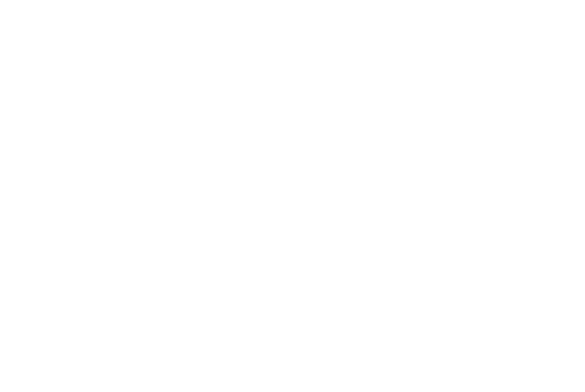

<p align="center">
  
</p>

<h1 align="center">ESP32 CAT Remote Panel</h1>
<p align="center"><sub><strong>CAT</strong> = Computer Aided Transceiver</sub></p>

<p align="center">
  <a href="#deutsch">🇩🇪 Deutsch</a> ·
  <a href="#english">🇬🇧 English</a>
</p>

<p align="center">
  <strong>DE:</strong> Funkfernbedienung mit Touch-Display, CAT, WiFi-Audio, FT8 · bis zu <strong>3× Funk + Rotor</strong><br>
  <strong>EN:</strong> Ham radio remote panel with touch UI, CAT, WiFi audio, FT8 · up to <strong>3× radios + rotor</strong>
</p>

<p align="center">
  ICOM CI-V · Yaesu CAT · Xiegu · flrig · WSJT-X · Hamlib rigctld · rotctld
</p>

<p align="center">
  <a href="docs/GUIDE_DE.md">📖 Guide (DE)</a> ·
  <a href="hardware/esp32-flrig-shield/README.md">🛠️ PCB / JLCPCB</a> ·
  <a href="docs/RADIOS.md">📻 Radios</a> ·
  <a href="docs/ISOLATION.md">🔌 Galvanische Trennung</a> ·
  <a href="docs/MULTI_RADIO_DE.md">📡 3× Funk</a> ·
  <a href="docs/MULTI_RADIO_EN.md">📡 3× Radio (EN)</a> ·
  <a href="flasher/index.html">⚡ Web Flasher</a>
</p>

<p align="center">
  
  
  
  
  
  
</p>

<p align="center">
  
</p>

<p align="center">
  
</p>
<p align="center"><sub>DE: Platine Rev C · Kupfer, Lötstop, Paste, Silk, Bohrungen · EN: Rev C board preview</sub></p>

---

<a id="deutsch"></a>

## Deutsch

### Was ist das?

Ein **ESP32-Panel** (z. B. Cheap Yellow Display) oder **ESP32-S3 + Interface-Shield** steuert bis zu **drei Funkgeräte gleichzeitig** über **WiFi**:

- **Kanal A:** analoges **CAT + Audio** (RJ45 / I2S)
- **Kanal B & C:** **USB-A Buchsen** am Shield (USB-CAT + USB-Audio, ESP32-S3 Host)
- **Rotor:** **rotctld** parallel zu allen Funkkanälen

Ideal für **FT8/WSJT-X** am PC ohne USB-Kabel zum Funk. Shield **Rev C** trennt die **Masse jedes Funkgeräts galvanisch** ([Isolation](docs/ISOLATION.md)) — kein gemeinsamer GND beim Wechsel.

| Dienst | Port / Pfad |
|--------|-------------|
| rigctld Funk A | **4532** |
| rigctld Funk B | **4536** |
| rigctld Funk C | **4540** |
| rotctld Rotor | **4535** |
| Audio A | UDP **4533/4534**, Web `/audio` |
| Audio B | UDP **4538/4539**, Web `/audio_b` |
| Audio C | UDP **4541/4542**, Web `/audio_c` |

Details: **[docs/MULTI_RADIO_DE.md](docs/MULTI_RADIO_DE.md)**

### Unterstützte Funkgeräte

| Hersteller | Modelle |
|------------|---------|
| **Xiegu** | G90, X6100, X6200 |
| **Yaesu** | FT-991A, FT-910, FT-DX10, FT-DX101D/MP, FT-891, FT-897, FT-857 |
| Referenz | ICOM IC-7300 |

Profil in der Web-UI → Baudrate & Protokoll automatisch. **[docs/RADIOS.md](docs/RADIOS.md)**

### Schnellstart

**Firmware (1× Funk, CYD):**

```bash
pio run -e esp32-cyd -t upload
pio run -e esp32-cyd -t uploadfs
```

**Firmware (3× Funk + Rotor, Shield Rev B + ESP32-S3):**

```bash
pio run -e esp32-flrig-shield -t upload
pio run -e esp32-flrig-shield -t uploadfs
```

| Modus | SSID / IP | Konfiguration |
|-------|-----------|---------------|
| AP (Werk) | `ESP32-CAT-Panel` / `192.168.4.1` | http://192.168.4.1/ |
| WLAN | DHCP | Funkprofil wählen |

**CAT testen:**

```bash
rigctl -m 2 -r 192.168.4.1:4532 f    # Funk A
rigctl -m 2 -r 192.168.4.1:4536 f    # Funk B
rigctl -m 2 -r 192.168.4.1:4540 f    # Funk C
rotctl -m 2 -r 192.168.4.1:4535 p    # Rotor
```

### Interface-Platine Rev C (JLCPCB)

Shield mit **RJ45** (Funk A), **2× USB-A** (Funk B/C), **USB2422-Hub**, **Rotor** — **ISO7741 / ADuM4160 / Audio-Trafos**, getrennte Masse-Netze.

| Dokument | Inhalt |
|----------|--------|
| [Shield README](hardware/esp32-flrig-shield/README.md) | Übersicht |
| [Bauanleitung](hardware/esp32-flrig-shield/docs/ASSEMBLY.md) | Löten |
| [Schaltplan](hardware/esp32-flrig-shield/docs/SCHEMATIC.md) | Rev B Netze |
| [JLCPCB](hardware/esp32-flrig-shield/docs/JLCPCB_ORDER.md) | Bestellung |

**Gerber-ZIP (Rev C):** [`hardware/esp32-flrig-shield/fabrication/esp32-flrig-shield-jlc.zip`](hardware/esp32-flrig-shield/fabrication/esp32-flrig-shield-jlc.zip)

```bash
cd hardware/esp32-flrig-shield/kicad && python3 generate_gerbers.py --zip
```

> Vor Produktion: **DRC** in KiCad, USB-Hub mit Datenblatt prüfen, **≥2 A** +5 V für zwei USB-Funkgeräte.

### Weitere Dokumentation

| Thema | Link |
|-------|------|
| Ausführlicher Leitfaden | [docs/GUIDE_DE.md](docs/GUIDE_DE.md) |
| Hamlib rigctld | https://hamlib.sourceforge.net/html/rigctld.1.html |
| Hamlib rotctld | https://hamlib.sourceforge.net/html/rotctld.1.html |
| FT8 Setup | `scripts/ft8_setup.py` |

---

<a id="english"></a>

## English

### What is this?

An **ESP32 panel** (e.g. Cheap Yellow Display) or **ESP32-S3 + interface shield** controls up to **three transceivers at once** over **WiFi**:

- **Channel A:** analog **CAT + audio** (RJ45 / I2S)
- **Channels B & C:** **USB Type-A receptacles** on the shield (USB CAT + USB audio, ESP32-S3 host)
- **Rotor:** **rotctld** in parallel with all radio channels

Built for **FT8/WSJT-X** on a PC without running USB cables to each radio. Shield **Rev C** provides **galvanic isolation** per radio ([ISOLATION.md](docs/ISOLATION.md)) — no shared ground when switching rigs.

**CAT** means **Computer Aided Transceiver** (the control protocol), not construction equipment.

| Service | Port / path |
|---------|-------------|
| rigctld radio A | **4532** |
| rigctld radio B | **4536** |
| rigctld radio C | **4540** |
| rotctld rotor | **4535** |
| Audio A | UDP **4533/4534**, web `/audio` |
| Audio B | UDP **4538/4539**, web `/audio_b` |
| Audio C | UDP **4541/4542**, web `/audio_c` |

Details: **[docs/MULTI_RADIO_DE.md](docs/MULTI_RADIO_DE.md)** (German; English summary in this README)

### Supported radios

| Vendor | Models |
|--------|--------|
| **Xiegu** | G90, X6100, X6200 |
| **Yaesu** | FT-991A, FT-910, FT-DX10, FT-DX101D/MP, FT-891, FT-897, FT-857 |
| Reference | ICOM IC-7300 |

Pick a profile in the web UI for automatic baud rate and protocol. See **[docs/RADIOS.md](docs/RADIOS.md)**.

### Quick start

**Firmware (single radio, CYD):**

```bash
pio run -e esp32-cyd -t upload
pio run -e esp32-cyd -t uploadfs
```

**Firmware (3 radios + rotor, Shield Rev B + ESP32-S3):**

```bash
pio run -e esp32-flrig-shield -t upload
pio run -e esp32-flrig-shield -t uploadfs
```

Or use the **[Web Flasher](flasher/index.html)** in your browser.

| Mode | SSID / IP | Config |
|------|-----------|--------|
| AP (default) | `ESP32-CAT-Panel` / `192.168.4.1` | http://192.168.4.1/ |
| WiFi STA | DHCP | Select radio profile |

**Test CAT:**

```bash
rigctl -m 2 -r 192.168.4.1:4532 f    # Radio A
rigctl -m 2 -r 192.168.4.1:4536 f    # Radio B
rigctl -m 2 -r 192.168.4.1:4540 f    # Radio C
rotctl -m 2 -r 192.168.4.1:4535 p    # Rotor
```

### Rotor (Hamlib rotctld)

The ESP32 runs a **rotctld** server. Two **buttons** (azimuth) and two **open-collector** outputs drive external relay boards (NPN + flyback diode).

| Hamlib `M` direction | Value | OC GPIO (CYD default) |
|---------------------|-------|------------------------|
| Left (CCW) | 8 | GPIO **18** |
| Right (CW) | 16 | GPIO **19** |
| Buttons CCW / CW | — | GPIO **27** / **5** |

`OUTPUT_OPEN_DRAIN`: **LOW** = relay on. Port **4535** (not 4533 — that is audio UDP).

### Interface PCB Rev C (JLCPCB)

Shield with **RJ45** (radio A), **two USB-A ports** (B/C), **USB2422 hub**, **rotor** — **ISO7741 / ADuM4160 / audio transformers**, separate ground nets.

| Document | Content |
|----------|---------|
| [Shield README](hardware/esp32-flrig-shield/README.md) | Overview |
| [Assembly](hardware/esp32-flrig-shield/docs/ASSEMBLY.md) | Soldering |
| [Schematic](hardware/esp32-flrig-shield/docs/SCHEMATIC.md) | Rev B nets |
| [JLCPCB order](hardware/esp32-flrig-shield/docs/JLCPCB_ORDER.md) | Ordering |

**Gerber ZIP (Rev B):** [`hardware/esp32-flrig-shield/fabrication/esp32-flrig-shield-jlc.zip`](hardware/esp32-flrig-shield/fabrication/esp32-flrig-shield-jlc.zip)

```bash
cd hardware/esp32-flrig-shield/kicad && python3 generate_gerbers.py --zip
```

> Before ordering: run **DRC** in KiCad, verify the USB hub footprint, supply **≥2 A** at +5 V when two USB radios are connected.

### Hardware (CYD overview)

| Signal | GPIO (CYD) |
|--------|------------|
| CAT RX / TX | 16 / 17 |
| I2S BCLK / LRCK | 26 / 25 |
| I2S DOUT / DIN | 22 / 4 |
| Pots 1–5 | 32, 35, 34, 39, 36 |
| Rotor buttons CCW / CW | 27 / 5 |
| Rotor OC CCW / CW | 18 / 19 |

CAT: **3.3 V TTL** + **TXS0102** to the radio (5 V). No MAX232 for TTL CAT.

### Project layout

```
esp32-flrig/
├── docs/              Guides, radio list, logo (PNG + SVG)
├── hardware/esp32-flrig-shield/
│   ├── kicad/         KiCad Rev B → JLCPCB
│   └── fabrication/   BOM, CPL, esp32-flrig-shield-jlc.zip
├── scripts/           FT8 setup (Linux / Windows)
├── src/               Firmware
└── flasher/           Browser flasher
```

### Architecture

```
┌─────────────┐  rigctld :4532/4536/4540   ┌──────────────┐  CAT/USB   ┌─────────┐
│ WSJT-X/flrig│◄──────────────────────────►│ ESP32 Panel  │◄──────────►│ 3× Radio│
└─────────────┘                            │ rotctld :4535│            └─────────┘
┌─────────────┐  rotctl                    │ Audio UDP    │
│ rotctl /    │◄──────────────────────────►│ Touch + Web  │
│ gpredict    │                            └──────────────┘
└─────────────┘
```

### FT8 / WSJT-X

```bash
pip install -r scripts/requirements-ft8.txt
cp scripts/ft8_config.example.json ~/.config/esp32-flrig/ft8.json
python3 scripts/ft8_setup.py --config ~/.config/esp32-flrig/ft8.json --test-cat --start
```

| OS | Script |
|----|--------|
| Linux | `./scripts/ft8_setup.sh 192.168.4.1 --pa --start` |
| Windows | `.\scripts\ft8_windows_setup.ps1 -EspHost 192.168.4.1 -InstallVbCable -StartBridge` |

### More links

| Topic | Reference |
|-------|-----------|
| Full guide (DE) | [docs/GUIDE_DE.md](docs/GUIDE_DE.md) |
| Hamlib rigctld | https://hamlib.sourceforge.net/html/rigctld.1.html |
| Hamlib rotctld | https://hamlib.sourceforge.net/html/rotctld.1.html |
| Audio monitor | http://\<ESP-IP\>/audio |

---

<p align="center">
  <sub>License: see repository · Contributions welcome · <a href="#deutsch">🇩🇪</a> · <a href="#english">🇬🇧</a></sub>
</p>
