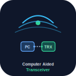

<p align="center">
  
</p>

<h1 align="center">ESP32 CAT Remote Panel</h1>

<p align="center">
  <strong>Funkfernbedienung mit Touch-Display, CAT, WiFi-Audio und FT8</strong><br>
  ICOM CI-V · Yaesu CAT · Xiegu · flrig · WSJT-X · Hamlib rigctld · rotctld
</p>

<p align="center">
  <a href="docs/GUIDE_DE.md">📖 Vollständiger Leitfaden</a> ·
  <a href="hardware/esp32-flrig-shield/README.md">🛠️ PCB / JLCPCB</a> ·
  <a href="docs/RADIOS.md">📻 Funkgeräte</a> ·
  <a href="flasher/index.html">⚡ Web Flasher</a>
</p>

<p align="center">
  
  
  
  
  
  
</p>

---

## Was ist das?

Ein **ESP32-Panel** (z. B. Cheap Yellow Display) steuert dein Funkgerät **direkt per CAT** und optional **Audio über WiFi** — ideal für **FT8/WSJT-X** am PC ohne USB-Kabel zum Funk.

<p align="center">
  
</p>

| Pfad | Funktion |
|------|----------|
| **CAT** | [rigctld](https://hamlib.sourceforge.net/html/rigctld.1.html) **4532** — flrig, WSJT-X (`rigctl -m 2`) |
| **Rotor** | [rotctld](https://hamlib.sourceforge.net/html/rotctld.1.html) **4535** — `rotctl -m 2`, 2× Taster, 2× OC-Relais |
| **Audio** | UDP **4533** / **4534** oder WebSocket `/ws/audio` @ 48 kHz |
| **Panel** | 5× Potis, Touch-UI, Web-Konfiguration |

---

## Unterstützte Funkgeräte

| Hersteller | Modelle |
|------------|---------|
| **Xiegu** | G90, X6100, X6200 |
| **Yaesu** | FT-991A, FT-910, FT-DX10, FT-DX101D/MP, FT-891, FT-897, FT-857 |
| Referenz | ICOM IC-7300 |

Profil in der Web-UI wählen → **Baudrate & Protokoll automatisch**. Details: **[docs/RADIOS.md](docs/RADIOS.md)**

---

## Schnellstart

### 1 · Firmware

```bash
pio run -e esp32-cyd -t upload
pio run -e esp32-cyd -t uploadfs   # Web-UI / config.json
```

Oder **[Web Flasher](flasher/index.html)** im Browser.

### 2 · Verbinden

| Modus | SSID / IP | Konfiguration |
|-------|-----------|---------------|
| AP (Werk) | `ESP32-CAT-Panel` / `192.168.4.1` | http://192.168.4.1/ |
| WLAN | DHCP | Funkprofil unter **Funkgerät** wählen |

### 3 · CAT testen

```bash
rigctl -m 2 -r 192.168.4.1:4532 f
rigctl -m 2 -r 192.168.4.1:4532 m USB
```

### 4 · Rotor (Hamlib rotctld)

Der ESP32 fungiert als **rotctld**-Server ([Hamlib-Dokumentation](https://hamlib.sourceforge.net/html/rotctld.1.html)). Am **GPIO** hängen zwei **Taster** (links/rechts) und zwei **Open-Collector-Ausgänge** für Relais (NPN + Freilaufdiode extern).

```bash
rotctl -m 2 -r 192.168.4.1:4535 p          # Azimut / Elevierung lesen
rotctl -m 2 -r 192.168.4.1:4535 M 8 50    # links, Speed 50
rotctl -m 2 -r 192.168.4.1:4535 M 16 50   # rechts
rotctl -m 2 -r 192.168.4.1:4535 S          # Stop
```

| Richtung (Hamlib `M`) | Wert | GPIO OC (CYD) |
|----------------------|------|----------------|
| Links (CCW) | 8 | GPIO **18** |
| Rechts (CW) | 16 | GPIO **19** |
| Taster CCW / CW | — | GPIO **27** / **5** |

**Open Collector:** `OUTPUT_OPEN_DRAIN` — **LOW** = Relais ein, **HIGH** = aus. Gemeinsame Masse ESP32 ↔ Relais ↔ Netzteil.

**Elevation:** wird nur gespeichert/abgefragt (`P`/`p`), nicht über Relais angesteuert (reine Azimut-OC-Schaltung).

Ports in der Web-UI unter **Rotor (Hamlib rotctld)** einstellbar. Standard-**rotctld-Port 4535** (nicht 4533 — der ist Audio-UDP).

### 5 · FT8 / WSJT-X

```bash
pip install -r scripts/requirements-ft8.txt
cp scripts/ft8_config.example.json ~/.config/esp32-flrig/ft8.json
# IP + radio_model anpassen

python3 scripts/ft8_setup.py --config ~/.config/esp32-flrig/ft8.json --test-cat --start
```

| OS | Setup-Skript |
|----|----------------|
| **Linux** | `./scripts/ft8_setup.sh 192.168.4.1 --pa --start` |
| **Windows** | `.\scripts\ft8_windows_setup.ps1 -EspHost 192.168.4.1 -InstallVbCable -StartBridge` |

---

## Interface-Platine (RJ45 + JLCPCB)

Eine **2-Layer-PCB** bündelt Pegelwandler, I2S-Audio und **einen RJ45** für Strom, CAT und Line-Audio zum Funk.

<p align="center">
  
</p>

| Dokument | Inhalt |
|----------|--------|
| [hardware/esp32-flrig-shield/README.md](hardware/esp32-flrig-shield/README.md) | Übersicht |
| [Bauanleitung](hardware/esp32-flrig-shield/docs/ASSEMBLY.md) | Löten & Inbetriebnahme |
| [Schaltplan](hardware/esp32-flrig-shield/docs/SCHEMATIC.md) | Netze & Blöcke |
| [RJ45 Pinout](hardware/esp32-flrig-shield/docs/RJ45_PINOUT.md) | Kabelbelegung ESP32-FLRIG-1 |
| [JLCPCB](hardware/esp32-flrig-shield/docs/JLCPCB_ORDER.md) | Gerber & Bestellung |

**Fertige Gerber:** [`hardware/esp32-flrig-shield/fabrication/esp32-flrig-shield-jlc.zip`](hardware/esp32-flrig-shield/fabrication/esp32-flrig-shield-jlc.zip) — direkt bei JLCPCB hochladen.

```bash
cd hardware/esp32-flrig-shield/kicad && ./export_gerbers.sh   # bei Änderungen neu erzeugen
```

> **Rev A:** KiCad-Projekt mit Footprints, GND-Plane und Basis-Routing. Vor Bestellung **DRC** und ggf. Leiterbahnen vervollständigen.

---

## Hardware (Übersicht)

**Empfohlen:** ESP32-2432S028 (CYD)

| Signal | GPIO (CYD) |
|--------|------------|
| CAT RX / TX | 16 / 17 |
| I2S BCLK / LRCK | 26 / 25 |
| I2S DOUT / DIN | 22 / 4 |
| Potis 1–5 | 32, 35, 34, 39, 36 |
| Rotor Taster CCW / CW | 27 / 5 |
| Rotor OC CCW / CW | 18 / 19 |

CAT: **3,3 V TTL** + **TXS0102** zum Funk (5 V). Kein MAX3232 bei TTL-CAT.

### Rotor — Anschluss OC + Taster

```
                    ESP32 GPIO (Open Drain)
                    ┌─────────────────────────┐
  Taster CCW ───────┤ GPIO27 (INPUT_PULLUP)   │
  Taster CW  ───────┤ GPIO5                   │
                    │ GPIO18 OC ──┬──► NPN ──► Relais Azimut CCW
                    │ GPIO19 OC ──┴──► NPN ──► Relais Azimut CW
                    └─────────────────────────┘
                           GND gemeinsam
```

Beispiel NPN (z. B. 2N2222 / BC547): Basis über **1 kΩ** vom GPIO, Emitter **GND**, Kollektor → Relais-Spule → **+12 V** (oder Rotor-Hilfsspannung), **Freilaufdiode** antiparallel zur Spule.

Ausführlich: **[docs/GUIDE_DE.md](docs/GUIDE_DE.md)** (Schaltpläne, AliExpress, Audio-Pegel, Mermaid).

---

## Projektstruktur

```
esp32-flrig/
├── docs/
│   ├── GUIDE_DE.md          # Ausführliche Dokumentation (DE)
│   ├── RADIOS.md            # Funkprofile
│   └── assets/logo.svg
├── hardware/esp32-flrig-shield/
│   ├── kicad/               # KiCad → JLCPCB
│   ├── fabrication/         # BOM, CPL
│   └── docs/                # Bauanleitung, RJ45
├── scripts/
│   ├── ft8_setup.py         # FT8 Setup (Linux/Win)
│   ├── ft8_setup.sh         # Linux Wrapper
│   ├── ft8_windows_setup.ps1
│   ├── ft8_remote.py
│   └── ft8_config.example.json
├── src/
│   ├── hamlib_tcp_server.cpp  # rigctld + rotctld TCP
│   ├── rotor_controller.cpp
│   └── rotctld_server.cpp
├── include/  data/
└── flasher/
```

---

## Architektur

```
┌─────────────┐  rigctld :4532   ┌──────────────┐  CAT UART    ┌─────────┐
│ WSJT-X/flrig│◄────────────────►│ ESP32 Panel  │◄────────────►│ Funk    │
└─────────────┘                  │ rotctld :4535│              └─────────┘
┌─────────────┐  rotctl          │ GPIO Taster  │──► Relais Azimut
│ gpredict /  │◄────────────────►│ GPIO OC      │
│ rotctl      │                  │ Audio :4533  │
└─────────────┘                  └──────────────┘
       ▲                                ▲
       └── ft8_remote.py (UDP) ─────────┘
```

---

## Hamlib — unterstützte Befehle

### rigctld (Port 4532)

Frequenz, Modus, PTT, Level, Split-Stubs für WSJT-X — siehe [rigctld.1](https://hamlib.sourceforge.net/html/rigctld.1.html) und [docs/GUIDE_DE.md](docs/GUIDE_DE.md).

### rotctld (Port 4535)

| Befehl | Funktion |
|--------|----------|
| `p` / `get_pos` | Azimut + Elevierung (Zeilenwerte + `RPRT 0`) |
| `P a e` / `set_pos` | Position setzen, Relais aus |
| `M dir speed` | Bewegen (8=links, 16=rechts; 2/4 für Up/Down reserviert) |
| `S` / `stop` | Stop, beide OC aus |
| `K` / `park` | wie Stop |
| `_` / `get_info` | Geräteinfo |

Protokoll wie [rotctld.1](https://hamlib.sourceforge.net/html/rotctld.1.html): eine Zeile pro Kommando, Antwort mit `RPRT 0` bei Erfolg.

---

## Links

| Thema | Referenz |
|-------|----------|
| Hamlib rigctld | https://hamlib.sourceforge.net/html/rigctld.1.html |
| Hamlib rotctld | https://hamlib.sourceforge.net/html/rotctld.1.html |
| Ausführlicher Leitfaden | [docs/GUIDE_DE.md](docs/GUIDE_DE.md) |
| FT8 Windows | `scripts/ft8_windows_setup.ps1` |
| FT8 Linux PA | `scripts/ft8_linux_pa.sh` |
| Audio-Monitor | http://\<ESP-IP\>/audio |

---

<p align="center">
  <sub>Lizenz: siehe Repository · Beiträge willkommen</sub>
</p>
