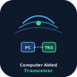

<p align="center">
  
</p>

<h1 align="center">ESP32 CAT Remote Panel</h1>

<p align="center"><sub><strong><a href="https://en.wikipedia.org/wiki/Computer_Aided_Transceiver">CAT</a></strong> = <a href="https://en.wikipedia.org/wiki/Computer_Aided_Transceiver">Computer Aided Transceiver</a> (not Caterpillar)</sub></p>

<p align="center">
  <a href="#deutsch">🇩🇪 Deutsch</a> ·
  <a href="#english">🇬🇧 English</a>
</p>

<p align="center">
  <strong>DE:</strong> Funkfernbedienung mit Touch-Display, <a href="https://en.wikipedia.org/wiki/Computer_Aided_Transceiver">CAT</a>, <a href="https://de.wikipedia.org/wiki/WLAN">WiFi</a>-Audio, <a href="https://de.wikipedia.org/wiki/FT8_(Amateurfunk)">FT8</a> · bis zu <strong>3× Funk + <a href="https://de.wikipedia.org/wiki/Rotor_(Antenne)">Rotor</a></strong><br>
  <strong>EN:</strong> <a href="https://en.wikipedia.org/wiki/Amateur_radio">Ham radio</a> remote panel with touch UI, <a href="https://en.wikipedia.org/wiki/Computer_Aided_Transceiver">CAT</a>, <a href="https://en.wikipedia.org/wiki/Wi-Fi">WiFi</a> audio, <a href="https://en.wikipedia.org/wiki/FT8_(digital_mode)">FT8</a> · up to <strong>3× radios + <a href="https://en.wikipedia.org/wiki/Antenna_rotator">rotor</a></strong>
</p>

<p align="center">
  <a href="https://de.wikipedia.org/wiki/Icom">ICOM</a> <a href="https://de.wikipedia.org/wiki/CI-V">CI-V</a> · <a href="https://de.wikipedia.org/wiki/Yaesu">Yaesu</a> <a href="https://en.wikipedia.org/wiki/Computer_Aided_Transceiver">CAT</a> · <a href="https://www.xiegu.com/">Xiegu</a> · <a href="https://github.com/w1hkj/flrig">flrig</a> · <a href="https://physics.princeton.edu/pulsar/k1jt/wsjtx.html">WSJT-X</a> · <a href="https://en.wikipedia.org/wiki/Hamlib">Hamlib</a> <a href="https://hamlib.sourceforge.net/html/rigctld.1.html">rigctld</a> · <a href="https://hamlib.sourceforge.net/html/rotctld.1.html">rotctld</a>
</p>

<p align="center">
  <a href="#deutsch">📖 DE</a> ·
  <a href="#english">📖 EN</a> ·
  <a href="docs/GUIDE_DE.md">Leitfaden (DE)</a> ·
  <a href="hardware/esp32-flrig-shield/README.md">🛠️ PCB</a> ·
  <a href="docs/RADIOS.md">📻 Radios</a> ·
  <a href="docs/ISOLATION.md">🔌 Isolation</a> ·
  <a href="docs/MULTI_RADIO_DE.md">📡 3× DE</a> ·
  <a href="docs/MULTI_RADIO_EN.md">📡 3× EN</a> ·
  <a href="docs/GLOSSARY.md">📚 Glossar</a> ·
  <a href="flasher/index.html">⚡ Flasher</a>
</p>

<p align="center">
  
  
  
  
  
  
</p>

<p align="center">
  
</p>

---

<a id="deutsch"></a>

## Deutsch

### Was ist das?

Ein **[ESP32](https://de.wikipedia.org/wiki/ESP32)-Panel** (z. B. [Cheap Yellow Display](https://github.com/witnessmenow/ESP32-Cheap-Yellow-Display)) oder **[ESP32-S3](https://www.espressif.com/en/products/socs/esp32-s3) + Interface-Shield** steuert bis zu **drei [Funkgeräten](https://de.wikipedia.org/wiki/Transceiver) gleichzeitig** über **[WiFi](https://de.wikipedia.org/wiki/WLAN)**:

| Kanal | Anbindung | [CAT](https://en.wikipedia.org/wiki/Computer_Aided_Transceiver) → PC | Audio → PC (eigenes [UDP](https://de.wikipedia.org/wiki/User_Datagram_Protocol)-Paar) |
|-------|-----------|----------|------------------------------|
| **A** | [RJ45](https://de.wikipedia.org/wiki/RJ-45) / [I2S](https://de.wikipedia.org/wiki/I%C2%B2S) | `:4532` | `4533` / `4534` |
| **B** | [USB-A](https://de.wikipedia.org/wiki/USB) J5 | `:4536` | `4538` / `4539` |
| **C** | [USB](https://de.wikipedia.org/wiki/Universal_Serial_Bus)-A J6 | `:4540` | `4541` / `4542` |
| **[Rotor](https://de.wikipedia.org/wiki/Rotor_(Antenne))** | [GPIO](https://de.wikipedia.org/wiki/General_Purpose_Input/Output) | `:4535` | — |

Ideal für **[FT8](https://de.wikipedia.org/wiki/FT8_(Amateurfunk))/[WSJT-X](https://physics.princeton.edu/pulsar/k1jt/wsjtx.html)** am PC ohne [USB-Kabel](https://de.wikipedia.org/wiki/Universal_Serial_Bus) zum Funk. Shield **Rev C** trennt die **Masse jedes Funkgeräts [galvanisch](https://de.wikipedia.org/wiki/Galvanische_Trennung)** ([Isolation](docs/ISOLATION.md)).

**3 [Funkgeräte](https://de.wikipedia.org/wiki/Transceiver)** = am PC **3 parallele, unabhängige** Ketten (je ein [rigctld](https://hamlib.sourceforge.net/html/rigctld.1.html)-[TCP](https://de.wikipedia.org/wiki/Transmission_Control_Protocol)-Port + ein Audio-[UDP](https://de.wikipedia.org/wiki/User_Datagram_Protocol)-Paar + eigenes PC-Audiogerät, z. B. [VB-Cable](https://vb-audio.com/Cable/) A/B/C). Der ESP mischt die Streams **nicht**.

**[CAT](https://en.wikipedia.org/wiki/Computer_Aided_Transceiver)** = **[Computer Aided Transceiver](https://en.wikipedia.org/wiki/Computer_Aided_Transceiver)** (Steuerprotokoll, z. B. [CI-V](https://de.wikipedia.org/wiki/CI-V) / [Yaesu CAT](https://en.wikipedia.org/wiki/Computer_Aided_Transceiver)).

| PC-Instanz | [rigctld](https://hamlib.sourceforge.net/html/rigctld.1.html) ([CAT](https://en.wikipedia.org/wiki/Computer_Aided_Transceiver)) | Audio RX / TX ([UDP](https://de.wikipedia.org/wiki/User_Datagram_Protocol)) | Web |
|------------|---------------|---------------------|-----|
| Funk A | **4532** | **4533** / **4534** | `/audio` |
| Funk B | **4536** | **4538** / **4539** | `/audio_b` |
| Funk C | **4540** | **4541** / **4542** | `/audio_c` |
| [Rotor](https://de.wikipedia.org/wiki/Rotor_(Antenne)) | **4535** ([rotctld](https://hamlib.sourceforge.net/html/rotctld.1.html)) | — | — |

Details: [MULTI_RADIO_DE.md](docs/MULTI_RADIO_DE.md) · Beispiel-Konfig: [ft8_config.example-3radio.json](scripts/ft8_config.example-3radio.json)

### Unterstützte [Funkgeräte](https://de.wikipedia.org/wiki/Transceiver)

| Hersteller | Modelle |
|------------|---------|
| **[Xiegu](https://www.xiegu.com/)** | G90, [X6100](https://www.xiegu.com/), [X6200](https://www.xiegu.com/) |
| **[Yaesu](https://de.wikipedia.org/wiki/Yaesu)** | FT-991A, FT-910, FT-DX10, FT-DX101D/MP, FT-891, FT-897, FT-857 |
| Referenz | [ICOM](https://de.wikipedia.org/wiki/Icom) IC-7300 |

Profil in der Web-UI → Baudrate & Protokoll automatisch: [RADIOS.md](docs/RADIOS.md)

### Schnellstart

**Firmware (1× Funk, [CYD](https://github.com/witnessmenow/ESP32-Cheap-Yellow-Display)):**

```bash
pio run -e esp32-cyd -t upload
pio run -e esp32-cyd -t uploadfs
```

**Firmware (3× Funk + [Rotor](https://de.wikipedia.org/wiki/Rotor_(Antenne)), Shield Rev C + [ESP32-S3](https://www.espressif.com/en/products/socs/esp32-s3)):**

```bash
pio run -e esp32-flrig-shield -t upload
pio run -e esp32-flrig-shield -t uploadfs
```

Oder **[Web-Flasher](flasher/index.html)** im Browser.

| Modus | [SSID](https://de.wikipedia.org/wiki/Service_Set_Identifier) / IP | Konfiguration |
|-------|-----------|---------------|
| AP (Werk) | `ESP32-CAT-Panel` / `192.168.4.1` | http://192.168.4.1/ |
| [WLAN](https://de.wikipedia.org/wiki/WLAN) | [DHCP](https://de.wikipedia.org/wiki/Dynamic_Host_Configuration_Protocol) | Funkprofil wählen |

**[CAT](https://en.wikipedia.org/wiki/Computer_Aided_Transceiver) testen ([Computer Aided Transceiver](https://en.wikipedia.org/wiki/Computer_Aided_Transceiver)):**

```bash
rigctl -m 2 -r 192.168.4.1:4532 f    # Funk A
rigctl -m 2 -r 192.168.4.1:4536 f    # Funk B
rigctl -m 2 -r 192.168.4.1:4540 f    # Funk C
rotctl -m 2 -r 192.168.4.1:4535 p    # Rotor
```

### [Rotor](https://de.wikipedia.org/wiki/Rotor_(Antenne)) ([Hamlib](https://en.wikipedia.org/wiki/Hamlib) [rotctld](https://hamlib.sourceforge.net/html/rotctld.1.html))

Zwei **Taster** (Azimut) und zwei **[Open-Collector](https://de.wikipedia.org/wiki/Offener_Kollektor)-Ausgänge** für Relais ([NPN](https://de.wikipedia.org/wiki/Bipolartransistor) + [Freilaufdiode](https://de.wikipedia.org/wiki/Freilaufdiode) extern).

| Richtung (`M`) | Wert | OC-[GPIO](https://de.wikipedia.org/wiki/General_Purpose_Input/Output) ([CYD](https://github.com/witnessmenow/ESP32-Cheap-Yellow-Display)) |
|----------------|------|---------------|
| Links (CCW) | 8 | **18** |
| Rechts (CW) | 16 | **19** |
| Taster CCW / CW | — | **27** / **5** |

`OUTPUT_OPEN_DRAIN`: **LOW** = Relais ein. Port **4535** (nicht 4533 — Audio-[UDP](https://de.wikipedia.org/wiki/User_Datagram_Protocol)).

### Interface-Shield (Dokumentation)

| Dokument | Inhalt |
|----------|--------|
| [Shield README](hardware/esp32-flrig-shield/README.md#deutsch) | Übersicht (DE/EN) |
| [Schaltplan](hardware/esp32-flrig-shield/docs/SCHEMATIC.md) | Logik, Isolation |
| [Kabel](hardware/esp32-flrig-shield/docs/CABLE_ASSEMBLY.md) | RJ45 / Funk |
| [RJ45-Pinout](hardware/esp32-flrig-shield/docs/RJ45_PINOUT.md) | Steckerbelegung |

### [FT8](https://de.wikipedia.org/wiki/FT8_(Amateurfunk)) / [WSJT-X](https://physics.princeton.edu/pulsar/k1jt/wsjtx.html)

```bash
pip install -r scripts/requirements-ft8.txt
cp scripts/ft8_config.example.json ~/.config/esp32-flrig/ft8.json
python3 scripts/ft8_setup.py --config ~/.config/esp32-flrig/ft8.json --test-cat --start
```

| OS | Skript |
|----|--------|
| [Linux](https://de.wikipedia.org/wiki/Linux) | `./scripts/ft8_setup.sh 192.168.4.1 --pa --start` |
| [Windows](https://de.wikipedia.org/wiki/Microsoft_Windows) | `.\scripts\ft8_windows_setup.ps1 -EspHost 192.168.4.1 -InstallVbCable -StartBridge` |

### Hardware ([CYD](https://github.com/witnessmenow/ESP32-Cheap-Yellow-Display), Kanal A)

| Signal | [GPIO](https://de.wikipedia.org/wiki/General_Purpose_Input/Output) |
|--------|------|
| [CAT](https://en.wikipedia.org/wiki/Computer_Aided_Transceiver) RX / TX | 16 / 17 |
| [I2S](https://de.wikipedia.org/wiki/I%C2%B2S) BCLK / LRCK | 26 / 25 |
| [I2S](https://de.wikipedia.org/wiki/I%C2%B2S) DOUT / DIN | 22 / 4 |
| [Potis](https://de.wikipedia.org/wiki/Potentiometer) 1–5 | 32, 35, 34, 39, 36 |
| [Rotor](https://de.wikipedia.org/wiki/Rotor_(Antenne)) Taster / OC | 27, 5 / 18, 19 |

### Weitere Dokumentation

| Thema | Link |
|-------|------|
| Ausführlicher Leitfaden | [GUIDE_DE.md](docs/GUIDE_DE.md) (Deutsch) |
| [Hamlib](https://en.wikipedia.org/wiki/Hamlib) [rigctld](https://hamlib.sourceforge.net/html/rigctld.1.html) / [rotctld](https://hamlib.sourceforge.net/html/rotctld.1.html) | [rigctld](https://hamlib.sourceforge.net/html/rigctld.1.html) · [rotctld](https://hamlib.sourceforge.net/html/rotctld.1.html) |
| Audio-Monitor | http://\<ESP-IP\>/audio |

---

<a id="english"></a>

## English

### What is this?

An **[ESP32](https://en.wikipedia.org/wiki/ESP32) panel** (e.g. [Cheap Yellow Display](https://github.com/witnessmenow/ESP32-Cheap-Yellow-Display)) or **[ESP32-S3](https://www.espressif.com/en/products/socs/esp32-s3) + interface shield** controls up to **three [transceivers](https://en.wikipedia.org/wiki/Transceiver) at once** over **[WiFi](https://en.wikipedia.org/wiki/Wi-Fi)**:

| Channel | Connection | [CAT](https://en.wikipedia.org/wiki/Computer_Aided_Transceiver) → PC | Audio → PC (own [UDP](https://en.wikipedia.org/wiki/User_Datagram_Protocol) pair) |
|---------|------------|----------|---------------------------|
| **A** | [RJ45](https://en.wikipedia.org/wiki/Registered_jack) / [I2S](https://en.wikipedia.org/wiki/I%C2%B2S) | `:4532` | `4533` / `4534` |
| **B** | [USB-A](https://en.wikipedia.org/wiki/USB) J5 | `:4536` | `4538` / `4539` |
| **C** | [USB](https://en.wikipedia.org/wiki/USB)-A J6 | `:4540` | `4541` / `4542` |
| **[Rotor](https://en.wikipedia.org/wiki/Antenna_rotator)** | [GPIO](https://en.wikipedia.org/wiki/General-purpose_input/output) | `:4535` | — |

Built for **[FT8](https://en.wikipedia.org/wiki/FT8_(digital_mode))/[WSJT-X](https://physics.princeton.edu/pulsar/k1jt/wsjtx.html)** on a PC without [USB cables](https://en.wikipedia.org/wiki/USB) to each radio. Shield **Rev C** uses **[galvanic isolation](https://en.wikipedia.org/wiki/Galvanic_isolation)** per radio ([ISOLATION.md](docs/ISOLATION.md)).

**3 radios** = on the PC **3 parallel, independent** chains (one [rigctld](https://hamlib.sourceforge.net/html/rigctld.1.html) [TCP](https://en.wikipedia.org/wiki/Transmission_Control_Protocol) port + one audio [UDP](https://en.wikipedia.org/wiki/User_Datagram_Protocol) pair + separate PC audio device each, e.g. [VB-Cable](https://vb-audio.com/Cable/) A/B/C). The ESP does **not** mix streams.

**[CAT](https://en.wikipedia.org/wiki/Computer_Aided_Transceiver)** = **[Computer Aided Transceiver](https://en.wikipedia.org/wiki/Computer_Aided_Transceiver)** (control protocol) — not construction equipment.

| PC instance | [rigctld](https://hamlib.sourceforge.net/html/rigctld.1.html) ([CAT](https://en.wikipedia.org/wiki/Computer_Aided_Transceiver)) | Audio RX / TX ([UDP](https://en.wikipedia.org/wiki/User_Datagram_Protocol)) | Web |
|-------------|---------------|---------------------|-----|
| Radio A | **4532** | **4533** / **4534** | `/audio` |
| Radio B | **4536** | **4538** / **4539** | `/audio_b` |
| Radio C | **4540** | **4541** / **4542** | `/audio_c` |
| [Rotor](https://en.wikipedia.org/wiki/Antenna_rotator) | **4535** ([rotctld](https://hamlib.sourceforge.net/html/rotctld.1.html)) | — | — |

Details: [MULTI_RADIO_EN.md](docs/MULTI_RADIO_EN.md) · Example config: [ft8_config.example-3radio.json](scripts/ft8_config.example-3radio.json)

### Supported radios

| Vendor | Models |
|--------|--------|
| **[Xiegu](https://www.xiegu.com/)** | G90, X6100, X6200 |
| **[Yaesu](https://en.wikipedia.org/wiki/Yaesu_(brand))** | FT-991A, FT-910, FT-DX10, FT-DX101D/MP, FT-891, FT-897, FT-857 |
| Reference | [ICOM](https://en.wikipedia.org/wiki/Icom) IC-7300 |

Select a profile in the web UI: [RADIOS.md](docs/RADIOS.md)

### Quick start

**Firmware (single radio, [CYD](https://github.com/witnessmenow/ESP32-Cheap-Yellow-Display)):**

```bash
pio run -e esp32-cyd -t upload
pio run -e esp32-cyd -t uploadfs
```

**Firmware (3 radios + [rotor](https://en.wikipedia.org/wiki/Antenna_rotator), Shield Rev C + [ESP32-S3](https://www.espressif.com/en/products/socs/esp32-s3)):**

```bash
pio run -e esp32-flrig-shield -t upload
pio run -e esp32-flrig-shield -t uploadfs
```

Or the **[Web Flasher](flasher/index.html)** in your browser.

| Mode | [SSID](https://en.wikipedia.org/wiki/Service_set_(802.11_network)) / IP | Config |
|------|-----------|--------|
| AP (default) | `ESP32-CAT-Panel` / `192.168.4.1` | http://192.168.4.1/ |
| [WiFi](https://en.wikipedia.org/wiki/Wi-Fi) STA | [DHCP](https://en.wikipedia.org/wiki/Dynamic_Host_Configuration_Protocol) | Select radio profile |

**Test [CAT](https://en.wikipedia.org/wiki/Computer_Aided_Transceiver) ([Computer Aided Transceiver](https://en.wikipedia.org/wiki/Computer_Aided_Transceiver)):**

```bash
rigctl -m 2 -r 192.168.4.1:4532 f    # Radio A
rigctl -m 2 -r 192.168.4.1:4536 f    # Radio B
rigctl -m 2 -r 192.168.4.1:4540 f    # Radio C
rotctl -m 2 -r 192.168.4.1:4535 p    # Rotor
```

### [Rotor](https://en.wikipedia.org/wiki/Antenna_rotator) ([Hamlib](https://en.wikipedia.org/wiki/Hamlib) [rotctld](https://hamlib.sourceforge.net/html/rotctld.1.html))

Two **buttons** (azimuth) and two **[open-collector](https://en.wikipedia.org/wiki/Open_collector)** outputs for relays (external [NPN](https://en.wikipedia.org/wiki/Bipolar_junction_transistor) + [flyback diode](https://en.wikipedia.org/wiki/Flyback_diode)).

| Direction (`M`) | Value | OC [GPIO](https://en.wikipedia.org/wiki/General-purpose_input/output) ([CYD](https://github.com/witnessmenow/ESP32-Cheap-Yellow-Display)) |
|-----------------|-------|---------------|
| Left (CCW) | 8 | **18** |
| Right (CW) | 16 | **19** |
| Buttons CCW / CW | — | **27** / **5** |

`OUTPUT_OPEN_DRAIN`: **LOW** = relay on. Port **4535** (not 4533 — audio [UDP](https://en.wikipedia.org/wiki/User_Datagram_Protocol)).

### Interface shield (documentation)

| Document | Content |
|----------|---------|
| [Shield README](hardware/esp32-flrig-shield/README.md#english) | Overview (DE/EN) |
| [Schematic](hardware/esp32-flrig-shield/docs/SCHEMATIC.md) | Logic, isolation |
| [Cables](hardware/esp32-flrig-shield/docs/CABLE_ASSEMBLY.md) | RJ45 / radio |
| [RJ45 pinout](hardware/esp32-flrig-shield/docs/RJ45_PINOUT.md) | Connector pins |

### [FT8](https://en.wikipedia.org/wiki/FT8_(digital_mode)) / [WSJT-X](https://physics.princeton.edu/pulsar/k1jt/wsjtx.html)

```bash
pip install -r scripts/requirements-ft8.txt
cp scripts/ft8_config.example.json ~/.config/esp32-flrig/ft8.json
python3 scripts/ft8_setup.py --config ~/.config/esp32-flrig/ft8.json --test-cat --start
```

| OS | Script |
|----|--------|
| [Linux](https://en.wikipedia.org/wiki/Linux) | `./scripts/ft8_setup.sh 192.168.4.1 --pa --start` |
| [Windows](https://en.wikipedia.org/wiki/Microsoft_Windows) | `.\scripts\ft8_windows_setup.ps1 -EspHost 192.168.4.1 -InstallVbCable -StartBridge` |

### Hardware ([CYD](https://github.com/witnessmenow/ESP32-Cheap-Yellow-Display), channel A)

| Signal | [GPIO](https://en.wikipedia.org/wiki/General-purpose_input/output) |
|--------|------|
| [CAT](https://en.wikipedia.org/wiki/Computer_Aided_Transceiver) RX / TX | 16 / 17 |
| [I2S](https://en.wikipedia.org/wiki/I%C2%B2S) BCLK / LRCK | 26 / 25 |
| [I2S](https://en.wikipedia.org/wiki/I%C2%B2S) DOUT / DIN | 22 / 4 |
| Pots 1–5 | 32, 35, 34, 39, 36 |
| [Rotor](https://en.wikipedia.org/wiki/Antenna_rotator) buttons / OC | 27, 5 / 18, 19 |

[CAT](https://en.wikipedia.org/wiki/Computer_Aided_Transceiver) on [CYD](https://github.com/witnessmenow/ESP32-Cheap-Yellow-Display): **3.3 V [TTL](https://en.wikipedia.org/wiki/Transistor%E2%80%93transistor_logic)**; on the shield **[ISO7741](https://www.ti.com/product/ISO7741)** isolates [RJ45](https://en.wikipedia.org/wiki/Registered_jack) [CAT](https://en.wikipedia.org/wiki/Computer_Aided_Transceiver) from ESP ground.

### Project layout

```
esp32-flrig/
├── docs/              Guides, radio list, isolation
├── hardware/esp32-flrig-shield/
│   ├── docs/          Schematic, cables, RJ45
│   └── assets/        Block diagram
├── scripts/           FT8 setup (Linux / Windows)
├── src/               Firmware
└── flasher/           Browser flasher
```

### Architecture

```
┌─────────────┐  rigctld :4532/4536/4540   ┌──────────────┐  isolated   ┌─────────┐
│ WSJT-X/flrig│◄──────────────────────────►│ ESP32 Panel  │◄───────────►│ 3× Radio│
└─────────────┘                            │ rotctld :4535│             └─────────┘
┌─────────────┐  rotctl                    │ WiFi audio   │
│ rotctl      │◄──────────────────────────►│ Touch + Web  │
└─────────────┘                            └──────────────┘
```

### More links

| Topic | Link |
|-------|------|
| Full guide | [GUIDE_DE.md](docs/GUIDE_DE.md) (German) |
| [Hamlib](https://en.wikipedia.org/wiki/Hamlib) [rigctld](https://hamlib.sourceforge.net/html/rigctld.1.html) / [rotctld](https://hamlib.sourceforge.net/html/rotctld.1.html) | [rigctld](https://hamlib.sourceforge.net/html/rigctld.1.html) · [rotctld](https://hamlib.sourceforge.net/html/rotctld.1.html) |
| Audio monitor | http://\<ESP-IP\>/audio |

---

<p align="center">
  <sub>License: see repository · Contributions welcome · <a href="#deutsch">🇩🇪</a> · <a href="#english">🇬🇧</a></sub>
</p>
