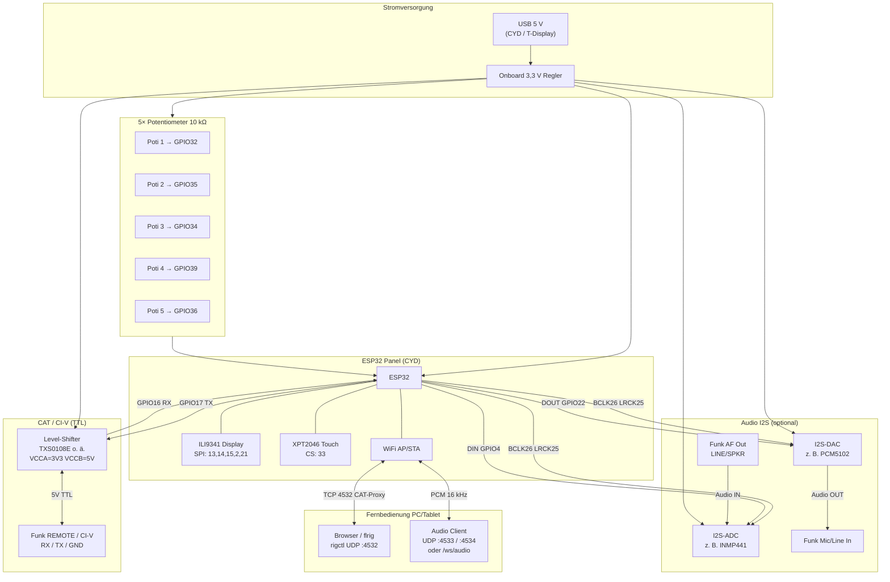
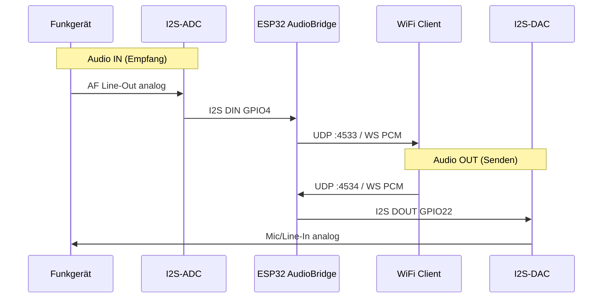
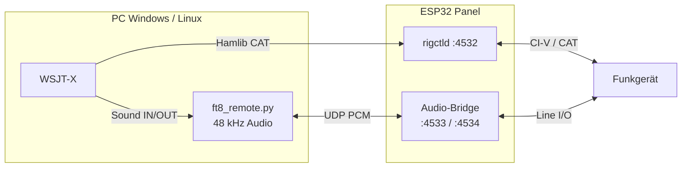

# [ESP32](https://de.wikipedia.org/wiki/ESP32) [CAT](https://en.wikipedia.org/wiki/Computer_Aided_Transceiver) Remote Panel — Ausführlicher Leitfaden

> **Kurzübersicht & [PCB](https://de.wikipedia.org/wiki/Leiterplatte):** [README.md](../README.md) · [Interface-Shield](../hardware/esp32-flrig-shield/README.md) · [Glossar](GLOSSARY.md#deutsch)  
> **[Rotor](https://de.wikipedia.org/wiki/Rotor_(Antenne)) ([rotctld](https://hamlib.sourceforge.net/html/rotctld.1.html), [GPIO](https://de.wikipedia.org/wiki/General_Purpose_Input/Output)):** vollständig im [README — Rotor](../README.md#4--rotor-hamlib-[rotctld](https://hamlib.sourceforge.net/html/rotctld.1.html))

[ESP32](https://de.wikipedia.org/wiki/ESP32)-basiertes Funkfernbedienungs-Panel mit Touch-Display, 5 programmierbaren [Potentiometern](https://de.wikipedia.org/wiki/Potentiometer), universeller **[ICOM](https://de.wikipedia.org/wiki/Icom) [CI-V](https://de.wikipedia.org/wiki/CI-V)** / **[Yaesu CAT](https://en.wikipedia.org/wiki/Computer_Aided_Transceiver)**-Steuerung, **Audio-Bridge** über [WiFi](https://de.wikipedia.org/wiki/WLAN) und **[FT8](https://de.wikipedia.org/wiki/FT8_(Amateurfunk))/[WSJT-X](https://physics.princeton.edu/pulsar/k1jt/wsjtx.html)**-Fernbetrieb ([Windows](https://de.wikipedia.org/wiki/Microsoft_Windows) & [Linux](https://de.wikipedia.org/wiki/Linux)). Kompatibel mit **[flrig](https://github.com/w1hkj/flrig)**, **[WSJT-X](https://physics.princeton.edu/pulsar/k1jt/wsjtx.html)** und **[Hamlib rigctld](https://hamlib.sourceforge.net/html/rigctld.1.html)** (Port 4532).

## Architektur

```
┌─────────────┐   WiFi/TCP:4532    ┌──────────────┐     I2S      ┌─────────┐
│ flrig/fldigi│◄──────────────────►│   ESP32      │◄────────────►│ Funk    │
│ WSJT-X etc. │   rigctl           │  rigctld     │   CAT UART   │ ICOM /  │
└─────────────┘                    │  Audio-UDP   │              │ YAESU   │
       ▲                           │  :4533/4534  │              └─────────┘
       │  optional                 └──────┬───────┘
       │  PCM 16 kHz mono                │ LVGL / Potis
┌──────┴──────┐                          │
│ PC / Browser│  UDP oder WebSocket /ws/audio
└─────────────┘
```

### Betriebsmodi

| Modus | Beschreibung |
|-------|-------------|
| **DIRECT_CAT** (Standard) | [ESP32](https://de.wikipedia.org/wiki/ESP32) steuert das [Funkgerät](https://de.wikipedia.org/wiki/Transceiver) direkt per [UART](https://de.wikipedia.org/wiki/Asynchrone_Serielle_Schnittstelle) |
| **Client → [flrig](https://github.com/w1hkj/flrig)** | [ESP32](https://de.wikipedia.org/wiki/ESP32) als [rigctl](https://hamlib.sourceforge.net/html/rigctl.1.html)-Client zu PC mit [flrig](https://github.com/w1hkj/flrig) (Modell 4, Port 12345) |
| **Client → [rigctld](https://hamlib.sourceforge.net/html/rigctld.1.html)** | [ESP32](https://de.wikipedia.org/wiki/ESP32) als Client zu [Hamlib](https://en.wikipedia.org/wiki/Hamlib) [rigctld](https://hamlib.sourceforge.net/html/rigctld.1.html) auf dem PC |

## Hardware

### Empfohlen: [ESP32](https://de.wikipedia.org/wiki/ESP32)-2432S028 ([Cheap Yellow Display](https://de.wikipedia.org/wiki/ESP32-Cheap-Yellow-Display))

| Funktion | [GPIO](https://de.wikipedia.org/wiki/General_Purpose_Input/Output) |
|----------|------|
| [CAT](https://en.wikipedia.org/wiki/Computer_Aided_Transceiver) RX | 16 |
| [CAT](https://en.wikipedia.org/wiki/Computer_Aided_Transceiver) TX | 17 |
| [I2S](https://de.wikipedia.org/wiki/I%C2%B2S) BCLK / LRCK | 26 / 25 |
| [I2S](https://de.wikipedia.org/wiki/I%C2%B2S) DOUT (→ DAC, Mic-In) | 22 |
| [I2S](https://de.wikipedia.org/wiki/I%C2%B2S) DIN (← ADC, Line-Out) | 4 |
| Poti 1–5 | 32, 35, 34, 39, 36 |
| Display/Touch | onboard (ILI9341 + XPT2046) |

GPIO33 ist auf dem [CYD](https://github.com/witnessmenow/ESP32-Cheap-Yellow-Display) **Touch-CS** – nicht als Poti belegen (siehe `include/config.h`).

### Pinbelegung (Übersicht)

| Bereich | [CYD](https://github.com/witnessmenow/ESP32-Cheap-Yellow-Display) | T-Display | Belegung |
|---------|-----|-----------|----------|
| Display SPI | 13, 14, 15, 2, 21 | 19, 18, 5, 16, 23, 4 | onboard |
| Touch CS | 33 | – | nur [CYD](https://github.com/witnessmenow/ESP32-Cheap-Yellow-Display) |
| [CAT](https://en.wikipedia.org/wiki/Computer_Aided_Transceiver) [UART](https://de.wikipedia.org/wiki/Asynchrone_Serielle_Schnittstelle) | 16 RX, 17 TX | 27 RX, 17 TX | [Level-Shifter](https://de.wikipedia.org/wiki/Pegelwandler) |
| [I2S](https://de.wikipedia.org/wiki/I%C2%B2S) Audio | 26 BCLK, 25 LRCK, 22 DOUT, 4 DIN | 12–15 | siehe Audio |
| [Potis](https://de.wikipedia.org/wiki/Potentiometer) ADC | 32, 35, 34, 39, 36 | 32, 33, 25, 26, 34 | 10 kΩ |
| Tasten | – | 35, 0 | nur T-Display |

---

## Vollständiger Schaltplan

Das System besteht aus vier Pfaden: **Stromversorgung**, **[CAT](https://en.wikipedia.org/wiki/Computer_Aided_Transceiver)**, **Audio ([I2S](https://de.wikipedia.org/wiki/I%C2%B2S))** und **Bedienung ([Potis](https://de.wikipedia.org/wiki/Potentiometer)/Display)**. Alle Massen ([ESP32](https://de.wikipedia.org/wiki/ESP32), Shifter, [I2S](https://de.wikipedia.org/wiki/I%C2%B2S)-Module, [Funkgerät](https://de.wikipedia.org/wiki/Transceiver)) über **einen gemeinsamen GND-Stern** verbinden.



### Schaltplan [CAT](https://en.wikipedia.org/wiki/Computer_Aided_Transceiver) + [Potis](https://de.wikipedia.org/wiki/Potentiometer) (Detail, [CYD](https://github.com/witnessmenow/ESP32-Cheap-Yellow-Display))

```
                         ┌──────────────────────────────────────────────────────────┐
    USB 5V ─────────────►│ ESP32-2432S028 (CYD)                                     │
                         │                                                          │
    3V3 ────┬────────────┤ VCC                                                      │
            │            │                                                          │
            │    ┌───────┴───────┐                                                  │
            │    │ Level-Shifter │  VCCA ◄── 3V3        VCCB ◄── Funk +5V (oder 5V-Regler) │
            │    │  (bidirekt.)  │  GND  ◄──┴──────────────┴── Funk GND / ESP GND       │
            │    │               │                                                       │
            ├───►│ A1 ─── B1 ────┼──────────────────────────► Funk CAT RX              │
            │    │ A2 ◄── B2 ◄───┼────────────────────────── Funk CAT TX              │
            │    └───────────────┘                                                       │
            │         ▲           ▲                                                      │
            │    GPIO17 TX   GPIO16 RX                                                   │
            │                                                                            │
            │    Poti 1..5:  3V3 ──[10k]──┬── GPIO 32,35,34,39,36 ──[100nF optional]── GND
            │                            Mitte                                           │
            │    Display/Touch: onboard (GPIO 2,13,14,15,21,33)                          │
            │                                                                            │
            │    I2S (optional):                                                         │
            │      GPIO26 BCLK ─────┬────────────── PCM5102 BCK / INMP441 SCK            │
            │      GPIO25 LRCK ─────┼────────────── PCM5102 LCK / INMP441 WS             │
            │      GPIO22 DOUT ────────────────► PCM5102 DIN                             │
            │      GPIO4  DIN  ◄──────────────── INMP441 SD                              │
            │      3V3, GND ─────────────────── beide Module                             │
            └──────────────────────────────────────────────────────────────────────────┘
```

### [CAT](https://en.wikipedia.org/wiki/Computer_Aided_Transceiver)-Schnittstelle ([TTL](https://de.wikipedia.org/wiki/Transistor-Transistor-Logik), kein [MAX3232](https://de.wikipedia.org/wiki/MAX3232))

Die Firmware nutzt **3,3-V-[TTL](https://de.wikipedia.org/wiki/Transistor-Transistor-Logik)-[UART](https://de.wikipedia.org/wiki/Asynchrone_Serielle_Schnittstelle)** (`SERIAL_8N1`). Moderne [ICOM](https://de.wikipedia.org/wiki/Icom)- und [Yaesu](https://de.wikipedia.org/wiki/Yaesu)-[CAT](https://en.wikipedia.org/wiki/Computer_Aided_Transceiver)-Anschlüsse sind **5-V-[TTL](https://de.wikipedia.org/wiki/Transistor-Transistor-Logik)**, nicht [RS-232](https://de.wikipedia.org/wiki/RS-232) (±12 V).

| Schnittstelle | Spannung / Logik | Für dieses Projekt |
|---------------|------------------|--------------------|
| [ICOM](https://de.wikipedia.org/wiki/Icom) [CI-V](https://de.wikipedia.org/wiki/CI-V), [Yaesu CAT](https://en.wikipedia.org/wiki/Computer_Aided_Transceiver) (typisch) | 5-V-[TTL](https://de.wikipedia.org/wiki/Transistor-Transistor-Logik), 8N1 | **[Level-Shifter](https://de.wikipedia.org/wiki/Pegelwandler)** 3,3 V ↔ 5 V |
| Echter [RS-232](https://de.wikipedia.org/wiki/RS-232) (DE-9, ± Pegel) | [RS-232](https://de.wikipedia.org/wiki/RS-232) | **[MAX3232](https://de.wikipedia.org/wiki/MAX3232)** o. Ä. – nur wenn das [Funkgerät](https://de.wikipedia.org/wiki/Transceiver) wirklich [RS-232](https://de.wikipedia.org/wiki/RS-232) liefert |
| [USB](https://de.wikipedia.org/wiki/Universal_Serial_Bus)-[CAT](https://en.wikipedia.org/wiki/Computer_Aided_Transceiver)-Adapter am PC | [USB](https://de.wikipedia.org/wiki/Universal_Serial_Bus) → [TTL](https://de.wikipedia.org/wiki/Transistor-Transistor-Logik) im Adapter | Nicht zwischen [ESP32](https://de.wikipedia.org/wiki/ESP32) und [Funkgerät](https://de.wikipedia.org/wiki/Transceiver) |

**[MAX3232](https://de.wikipedia.org/wiki/MAX3232) ist nicht vorgesehen**, solange der [CAT](https://en.wikipedia.org/wiki/Computer_Aided_Transceiver)-Port des Funkgeräts [TTL](https://de.wikipedia.org/wiki/Transistor-Transistor-Logik) ist (Standard bei IC-7300, FTdx-Serie, u. a.). Ein [MAX3232](https://de.wikipedia.org/wiki/MAX3232) würde bei [TTL](https://de.wikipedia.org/wiki/Transistor-Transistor-Logik)-[CAT](https://en.wikipedia.org/wiki/Computer_Aided_Transceiver) die Pegel falsch wandeln und die Kommunikation stören.

#### Verdrahtung [Level-Shifter](https://de.wikipedia.org/wiki/Pegelwandler) (z. B. [TXS0108E](https://www.ti.com/product/TXS0108E), 2 Kanäle)

```
                    Level-Shifter (bidirektional)
                    ┌─────────────────────────────┐
  ESP32 3V3 ────────┤ VCCA                        │
  Funk  +5V ────────┤ VCCB   (Referenz vom Radio │
  gemeinsam GND ────┤ GND    oder 5V-Regler)    │
                    │                             │
  GPIO17 TX ────────┤ A1 ─────────── B1 ─────────┼──► Funk RX
  GPIO16 RX ◄───────┤ A2 ─────────── B2 ◄────────┼──── Funk TX
                    └─────────────────────────────┘

  ESP32 GND ─────────────── gemeinsam ───────────── Funk GND
```

| Signal | [ESP32](https://de.wikipedia.org/wiki/ESP32) (3,3 V) | Shifter | [Funkgerät](https://de.wikipedia.org/wiki/Transceiver) (5 V [TTL](https://de.wikipedia.org/wiki/Transistor-Transistor-Logik)) |
|--------|---------------|---------|---------------------|
| Senden | GPIO17 → A1 | B1 → | [CAT](https://en.wikipedia.org/wiki/Computer_Aided_Transceiver) **RX** |
| Empfangen | GPIO16 ← A2 | B2 ← | [CAT](https://en.wikipedia.org/wiki/Computer_Aided_Transceiver) **TX** |
| Masse | GND | GND | GND |

**Hinweise:**

- TX/RX **kreuzen**: ESP-TX → Funk-RX, ESP-RX ← Funk-TX.
- Nur **ein** GND zwischen Panel, Shifter und [Funkgerät](https://de.wikipedia.org/wiki/Transceiver); lange gemeinsame Masseleitung vermeiden.
- Baudrate in der Web-UI wählen: [ICOM](https://de.wikipedia.org/wiki/Icom) meist **19200**, [Yaesu](https://de.wikipedia.org/wiki/Yaesu) meist **38400** (modellabhängig).
- 3,3-V-[TTL](https://de.wikipedia.org/wiki/Transistor-Transistor-Logik)-[CAT](https://en.wikipedia.org/wiki/Computer_Aided_Transceiver) (selten): Shifter optional; Radio-Datenblatt prüfen, ob 3,3 V tolerant ist.

#### [RS-232](https://de.wikipedia.org/wiki/RS-232) nur bei Bedarf (Sonderfall)

```
ESP32 GPIO17/16 ──► MAX3232 TTL-Seite ──► DE-9 RS-232 ──► Funk/Adapter (RS-232)
```

Nur verwenden, wenn der Hersteller ausdrücklich einen **[RS-232](https://de.wikipedia.org/wiki/RS-232)**-[CAT](https://en.wikipedia.org/wiki/Computer_Aided_Transceiver)-Port dokumentiert. Die Firmware bleibt unverändert; nur die Hardware wandelt die Pegel.

### [Potentiometer](https://de.wikipedia.org/wiki/Potentiometer) (5×)

```
        3V3
         │
    ┌────┴────┐
   ╱           ╲
  │  10 kΩ     │  Poti (Bourns/trimmer o. ä.)
  │            │
  └─────┬──────┘
        │
        ├────────────► GPIO (ADC, siehe Pin-Tabelle)
        │
       GND
```

| Poti | [CYD](https://github.com/witnessmenow/ESP32-Cheap-Yellow-Display) (`esp32-cyd`) | T-Display (`esp32-tdisplay`) |
|------|-------------------|------------------------------|
| 1 | GPIO32 | GPIO32 |
| 2 | GPIO35 | GPIO33 |
| 3 | GPIO34 | GPIO25 |
| 4 | GPIO39 | GPIO26 |
| 5 | GPIO36 | GPIO34 |

- Widerstandswert **10 kΩ** (typisch), Mittelabgriff an [GPIO](https://de.wikipedia.org/wiki/General_Purpose_Input/Output), Außen an **3,3 V** und **GND**.
- Nur **3,3 V** am ADC – nie 5 V direkt an [GPIO](https://de.wikipedia.org/wiki/General_Purpose_Input/Output).
- Entstörung optional: **100 nF** von Mittelabgriff nach GND, nah am Poti.

### [Stückliste](https://de.wikipedia.org/wiki/St%C3%BCckliste) (komplett)

| Stück | Wert / Typ | Anzahl | Anmerkung |
|-------|------------|--------|-----------|
| [ESP32](https://de.wikipedia.org/wiki/ESP32)-2432S028 ([CYD](https://github.com/witnessmenow/ESP32-Cheap-Yellow-Display)) oder [TTGO](https://en.wikipedia.org/wiki/LilyGo) T-Display | – | 1 | `platformio.ini` |
| [Level-Shifter](https://de.wikipedia.org/wiki/Pegelwandler) | [TXS0108E](https://www.ti.com/product/TXS0108E), BSS138-Modul | 1 | [CAT](https://en.wikipedia.org/wiki/Computer_Aided_Transceiver): 2 Kanäle |
| [Potentiometer](https://de.wikipedia.org/wiki/Potentiometer) | 10 kΩ linear | 5 | ADC 3,3 V |
| Kabel | abgeschirmt | – | [CAT](https://en.wikipedia.org/wiki/Computer_Aided_Transceiver) + Audio getrennt |
| 100 nF [Keramik](https://de.wikipedia.org/wiki/Keramikkondensator) | – | 5–7 | Poti + Audio |
| **Audio IN (Empfang)** | [INMP441](https://www.invensense.com/products/digital/inmp441/) / ICS-43434 | 1 | [I2S](https://de.wikipedia.org/wiki/I%C2%B2S)-ADC |
| **Audio OUT (Senden)** | [PCM5102](https://www.ti.com/product/PCM5102) / [MAX98357A](https://www.analog.com/en/products/max98357a.html) | 1 | [I2S](https://de.wikipedia.org/wiki/I%C2%B2S)-DAC |
| [Elko](https://de.wikipedia.org/wiki/Elektrolytkondensator) / MKP | 10 µF | 2 | AC-Kopplung Audio |
| Widerstände | 10 kΩ, 22 kΩ, 1 kΩ | je 2 | Teiler + Pegel |
| Trimmer | 10 kΩ | 1 | Mic-Pegel einstellen |

> **Hinweis [CYD](https://github.com/witnessmenow/ESP32-Cheap-Yellow-Display) + Audio:** Auf dem [ESP32](https://de.wikipedia.org/wiki/ESP32)-2432S028 ist **GPIO26** auf manchen Revisionen mit dem **onboard-Lautsprecher-Verstärker (PAM8302)** verbunden. Die Firmware nutzt GPIO26 als **[I2S](https://de.wikipedia.org/wiki/I%C2%B2S) BCLK**. Funktioniert [I2S](https://de.wikipedia.org/wiki/I%C2%B2S) nicht stabil, in `include/config.h` andere freie Pins wählen oder Lautsprecher-Funktion des [CYD](https://github.com/witnessmenow/ESP32-Cheap-Yellow-Display) nicht verwenden.

---

### Beschaffung ([AliExpress](https://de.wikipedia.org/wiki/AliExpress)) und Modul-Anschluss

Die Links sind **Suchseiten** (Händler und Artikelnummern wechseln). Vor dem Kauf prüfen: Bewertungen, „[ESP32](https://de.wikipedia.org/wiki/ESP32)-2432S028“ / „[INMP441](https://www.invensense.com/products/digital/inmp441/)“ / „[PCM5102](https://www.ti.com/product/PCM5102)“ im Titel, Spannung **3,3 V** für [I2S](https://de.wikipedia.org/wiki/I%C2%B2S)-Module.

| # | Bauteil | [AliExpress](https://de.wikipedia.org/wiki/AliExpress) (Suche) | Anschluss-Kurzinfo |
|---|---------|-------------------|-------------------|
| 1 | **[ESP32](https://de.wikipedia.org/wiki/ESP32)-2432S028 ([CYD](https://github.com/witnessmenow/ESP32-Cheap-Yellow-Display))** | [ESP32-2432S028](https://de.wikipedia.org/wiki/ESP32-2432S028.html) | [USB](https://de.wikipedia.org/wiki/Universal_Serial_Bus)-Strom, Display/Touch onboard; freie Pins an P3/CN1 (siehe Pinout) |
| 2 | **[TTGO](https://en.wikipedia.org/wiki/LilyGo) T-Display v1.1** (Alternative) | [TTGO T-Display](https://de.wikipedia.org/wiki/ESP32.html) | Kompakter, kein Touch; [I2S](https://de.wikipedia.org/wiki/I%C2%B2S) auf [GPIO](https://de.wikipedia.org/wiki/General_Purpose_Input/Output) 12–15 |
| 3 | **[Level-Shifter](https://de.wikipedia.org/wiki/Pegelwandler) 3,3↔5 V** | [TXS0108E 4-Kanal](https://www.aliexpress.com/w/wholesale-TXS0108E-level-shifter.html) · [BSS138 Modul](https://www.aliexpress.com/w/wholesale-BSS138-level-shifter-module.html) | 2 Kanäle für [CAT](https://en.wikipedia.org/wiki/Computer_Aided_Transceiver) TX/RX, siehe [CAT-Modul](#3-level-shifter-cat--ci-v) |
| 4 | **[INMP441](https://www.invensense.com/products/digital/inmp441/) [I2S](https://de.wikipedia.org/wiki/I%C2%B2S)** (Audio IN) | [INMP441 Modul](https://www.invensense.com/products/digital/inmp441/-I2S-module.html) | Empfang vom Funk-Line-Out, siehe [Audio IN Modul](#4-inmp441-audio-in--empfang-vom-funk) |
| 5 | **[PCM5102](https://www.ti.com/product/PCM5102) [I2S](https://de.wikipedia.org/wiki/I%C2%B2S) DAC** (Audio OUT) | [PCM5102 Modul](https://www.aliexpress.com/w/wholesale-PCM5102-I2S-DAC.html) | Zum Funk-Line/Mic-In, siehe [Audio OUT Modul](#5-pcm5102-audio-out--senden-zum-funk) |
| 5b | Alternative DAC+Verstärker | [MAX98357A I2S](https://de.wikipedia.org/wiki/I%C2%B2S.html) | Lauterer Ausgang; Pegel ggf. noch dämpfen vor TRX |
| 6 | **[Potentiometer](https://de.wikipedia.org/wiki/Potentiometer) 10 kΩ** | [10 kΩ linear](https://www.aliexpress.com/w/wholesale-10k-rotary-potentiometer-linear.html) | 5× 3V3–Mitte–GND, siehe [Potis](#6-potentiometer) |
| 7 | **Widerstandsset** | [Widerstand Kit 10k 22k](https://www.aliexpress.com/w/wholesale-resistor-kit-1-4w.html) | Audio-Teiler + optional Pull-ups |
| 8 | **Kondensatoren 10 µF** | [10uF electrolytic](https://www.aliexpress.com/w/wholesale-10uf-capacitor.html) | Audio-Kopplung (elektrolytisch, Beobachtung Polung) |
| 9 | **[Dupont](https://de.wikipedia.org/wiki/Steckbrett#Steckbrücken)-Kabel** | [Dupont 40 Stück](https://www.aliexpress.com/w/wholesale-dupont-jumper-wires.html) | Female-Female für Breadboard |
| 10 | **[Steckbrett](https://de.wikipedia.org/wiki/Steckbrett)** (optional) | [Breadboard 830](https://www.aliexpress.com/w/wholesale-breadboard-830.html) | Prototyp vor fester Verdrahtung |
| 11 | **3,5-mm-Klinkenkabel** | [3.5mm audio cable](https://www.aliexpress.com/w/wholesale-3.5mm-audio-cable.html) | Funk Line-Out / Line-In (mono reicht, Stereo nur einen Kanal nutzen) |
| 12 | **[CI-V](https://de.wikipedia.org/wiki/CI-V) / Datenkabel** ([ICOM](https://de.wikipedia.org/wiki/Icom)) | [3.5mm TRS cable](https://www.aliexpress.com/w/wholesale-3.5mm-trs-cable.html) | Nur wenn Funk [CI-V](https://de.wikipedia.org/wiki/CI-V) an Klinkenbuchse hat – Pinbelegung im Handbuch! |

**Beispiel-Listing [CYD](https://github.com/witnessmenow/ESP32-Cheap-Yellow-Display)** (Varianten prüfen): [ESP32-2432S028 bei AliExpress](https://www.aliexpress.com/item/1005009152117243.html) – Titel muss **2432S028** enthalten; Display-Treiber ILI9341 oder ST7789 ist für diese Firmware unkritisch (`BOARD_CYD`).

#### Montage-Reihenfolge (empfohlen)

1. [CYD](https://github.com/witnessmenow/ESP32-Cheap-Yellow-Display) flashen und [CAT](https://en.wikipedia.org/wiki/Computer_Aided_Transceiver) ohne Audio testen ([Level-Shifter](https://de.wikipedia.org/wiki/Pegelwandler) + [Potis](https://de.wikipedia.org/wiki/Potentiometer)).
2. [INMP441](https://www.invensense.com/products/digital/inmp441/) + [PCM5102](https://www.ti.com/product/PCM5102) auf Breadboard verdrahten, gemeinsame I2S-Leitungen (BCLK/LRCK).
3. Audio-Pegelanpassung (10 µF, Teiler) **ohne** Funk testen (Web-UI `/audio`).
4. Zuletzt Funk Line-Out / Line-In mit niedrigem AF-Pegel anbinden.

---

#### 1. [ESP32](https://de.wikipedia.org/wiki/ESP32)-2432S028 ([CYD](https://github.com/witnessmenow/ESP32-Cheap-Yellow-Display)) – Basisplatine

| Anschluss am Board | Verwendung in diesem Projekt |
|--------------------|------------------------------|
| **Micro-[USB](https://de.wikipedia.org/wiki/Universal_Serial_Bus)** | 5 V Versorgung + Flash |
| **P3 / CN1** (3V3, GND, [GPIO](https://de.wikipedia.org/wiki/General_Purpose_Input/Output)) | [CAT](https://en.wikipedia.org/wiki/Computer_Aided_Transceiver), I2S, [Potis](https://de.wikipedia.org/wiki/Potentiometer) |
| **Onboard Display/Touch** | UI – keine Extra-Verdrahtung |

**Nicht belegen:** [GPIO](https://de.wikipedia.org/wiki/General_Purpose_Input/Output) **33** (Touch-CS), Display-SPI **2, 13, 14, 15, 21**.

Frei nutzbar ([CYD](https://github.com/witnessmenow/ESP32-Cheap-Yellow-Display), typisch): **4, 16, 17, 22, 25, 26, 27, 32, 34, 35, 36, 39** – genaue Belegung siehe Pin-Tabelle oben (26 ggf. Konflikt Lautsprecher).

---

#### 2. [Potentiometer](https://de.wikipedia.org/wiki/Potentiometer)

Typisches Modul mit **3 Pins** (links/rechts = Außen, Mitte = Schleifer):

```
Pin links  ──────── 3V3 (ESP)
Pin mitte  ──────── GPIOxx (Poti 1…5)
Pin rechts ──────── GND
```

| Poti # | [CYD](https://github.com/witnessmenow/ESP32-Cheap-Yellow-Display) [GPIO](https://de.wikipedia.org/wiki/General_Purpose_Input/Output) | Kabelfarbe (Beispiel) |
|--------|----------|------------------------|
| 1 | 32 | zu P3 |
| 2 | 35 | nur Input – gut für ADC |
| 3 | 34 | |
| 4 | 39 | nur Input |
| 5 | 36 | |

Optional **100 nF** zwischen Mitte und GND, direkt am Poti.

---

#### 3. [Level-Shifter](https://de.wikipedia.org/wiki/Pegelwandler) ([CAT](https://en.wikipedia.org/wiki/Computer_Aided_Transceiver) / [CI-V](https://de.wikipedia.org/wiki/CI-V))

Typisches **4-Kanal-BSS138-** oder **[TXS0108E](https://www.ti.com/product/TXS0108E)-Breakout**:

| Shifter-Pin | Verbindung |
|-------------|------------|
| **VCCA** / **LV** | ESP **3,3 V** |
| **VCCB** / **HV** | Funk **+5 V** (vom [CAT](https://en.wikipedia.org/wiki/Computer_Aided_Transceiver)-Port oder [USB](https://de.wikipedia.org/wiki/Universal_Serial_Bus)-Netzteil 5 V, **GND gemeinsam**) |
| **GND** | ESP GND + Funk GND |
| **A1** | ESP **GPIO17** (TX) |
| **B1** | Funk **RX** ([CAT](https://en.wikipedia.org/wiki/Computer_Aided_Transceiver) empfängt Befehle) |
| **A2** | ESP **GPIO16** (RX) |
| **B2** | Funk **TX** ([CAT](https://en.wikipedia.org/wiki/Computer_Aided_Transceiver) sendet Antworten) |

```
ESP TX (17) ──► A1 ── B1 ──► Funk RX
ESP RX (16) ◄── A2 ◄── B2 ◄── Funk TX
```

**[ICOM](https://de.wikipedia.org/wiki/Icom) [CI-V](https://de.wikipedia.org/wiki/CI-V) (3,5-mm-TRS):** Pinbelegung je Modell unterschiedlich (Ring/Sleeve = GND/ Daten). Nur mit offiziellem Kabel oder Pinout im Handbuch – falsche Belegung zerstört [CI-V](https://de.wikipedia.org/wiki/CI-V).

**[Yaesu](https://de.wikipedia.org/wiki/Yaesu):** oft Mini-DIN oder 3,5 mm; ebenfalls Handbuch prüfen.

---

#### 4. [INMP441](https://www.invensense.com/products/digital/inmp441/) (Audio IN – Empfang vom Funk)

Typische Beschriftung auf dem **[INMP441](https://www.invensense.com/products/digital/inmp441/)-Breakout**:

| [INMP441](https://www.invensense.com/products/digital/inmp441/) | [ESP32](https://de.wikipedia.org/wiki/ESP32) [CYD](https://github.com/witnessmenow/ESP32-Cheap-Yellow-Display) | Hinweis |
|---------|-----------|---------|
| **VDD** | 3,3 V | nie 5 V |
| **GND** | GND | |
| **SCK** / **BCLK** | [GPIO](https://de.wikipedia.org/wiki/General_Purpose_Input/Output) **26** | gemeinsam mit [PCM5102](https://www.ti.com/product/PCM5102) BCK |
| **WS** / **LRCK** | [GPIO](https://de.wikipedia.org/wiki/General_Purpose_Input/Output) **25** | gemeinsam mit [PCM5102](https://www.ti.com/product/PCM5102) LCK |
| **SD** / **DOUT** | [GPIO](https://de.wikipedia.org/wiki/General_Purpose_Input/Output) **4** (ESP [I2S](https://de.wikipedia.org/wiki/I%C2%B2S) DIN) | Daten vom Mikro/ADC zum ESP |
| **L/R** | **GND** | Mono = linker Kanal |
| **SEL** | GND oder 3,3 V | Datenblatt des Moduls |

**Analog vom Funk (Line-Out):**

```
Funk Tip/Ring (LINE +) ── 10 µF (+ zur Funk-Seite) ──┬── 10 kΩ ── INMP441 SD
Funk Sleeve (GND) ─────────────────────────────────┴── 22 kΩ ── GND
```

- AF am Funk **niedrig** starten (z. B. 10–20 %), sonst Clipping am ADC.
- **Kein** Speaker-Output des Funkgeräts direkt an [INMP441](https://www.invensense.com/products/digital/inmp441/) – immer Line-Out / DATA-Out nutzen.

---

#### 5. [PCM5102](https://www.ti.com/product/PCM5102) (Audio OUT – Senden zum Funk)

Typische Beschriftung **[PCM5102A](https://www.ti.com/product/PCM5102)-Modul** (ohne Verstärker):

| [PCM5102](https://www.ti.com/product/PCM5102) | [ESP32](https://de.wikipedia.org/wiki/ESP32) [CYD](https://github.com/witnessmenow/ESP32-Cheap-Yellow-Display) | Hinweis |
|---------|-----------|---------|
| **VIN** / **5V** | 5 V [USB](https://de.wikipedia.org/wiki/Universal_Serial_Bus) oder 3,3 V (nur wenn Modul 3,3-V-tauglich laut Beschreibung) | Modulbeschreibung lesen |
| **GND** | GND | |
| **BCK** | [GPIO](https://de.wikipedia.org/wiki/General_Purpose_Input/Output) **26** | mit [INMP441](https://www.invensense.com/products/digital/inmp441/) gemeinsam |
| **LCK** / **LRCK** | [GPIO](https://de.wikipedia.org/wiki/General_Purpose_Input/Output) **25** | |
| **DIN** | [GPIO](https://de.wikipedia.org/wiki/General_Purpose_Input/Output) **22** (ESP [I2S](https://de.wikipedia.org/wiki/I%C2%B2S) DOUT) | |
| **SCK** | **GND** (bei [PCM5102](https://www.ti.com/product/PCM5102) oft nicht nötig) | laut Modul-Anleitung |
| **VOUTL** / **ROUT** | über 10 µF + Trimmer zum Funk | Mono: einen Kanal nutzen |

**Zum [Funkgerät](https://de.wikipedia.org/wiki/Transceiver):**

```
PCM5102 VOUT ── 10 µF ── Mitte Trimmer 10 kΩ ── Funk LINE IN (+)
Trimmer andere Seite ── GND; Funk LINE GND ── gemeinsam ESP GND
```

- **IC-7300:** bevorzugt **LINE IN** (hinten), nicht HS-Mic ohne Adapter.
- Pegel mit Trimmer einstellen: zu laut → Übersteuerung / ALC-Pumpen; zu leise → kaum Modulation.
- **[PTT](https://de.wikipedia.org/wiki/Sende-Empfang-Umschaltung)** bleibt am Mikrofon des Funkgeräts oder per [CAT](https://en.wikipedia.org/wiki/Computer_Aided_Transceiver) (`T` / [rigctl](https://hamlib.sourceforge.net/html/rigctl.1.html)).

**[MAX98357A](https://www.analog.com/en/products/max98357a.html)** statt [PCM5102](https://www.ti.com/product/PCM5102): gleiche [I2S](https://de.wikipedia.org/wiki/I%C2%B2S)-Pins (BCLK/LRCK/DIN), Ausgang oft lauter – **zusätzlicher** Trimmer oder Widerstand vor dem TRX empfohlen.

---

#### 6. Übersicht: alle Verbindungen [CYD](https://github.com/witnessmenow/ESP32-Cheap-Yellow-Display) auf einen Blick

| ESP [GPIO](https://de.wikipedia.org/wiki/General_Purpose_Input/Output) | Richtung | Ziel |
|----------|----------|------|
| 17 | OUT | [Level-Shifter](https://de.wikipedia.org/wiki/Pegelwandler) A1 → Funk [CAT](https://en.wikipedia.org/wiki/Computer_Aided_Transceiver) RX |
| 16 | IN | [Level-Shifter](https://de.wikipedia.org/wiki/Pegelwandler) A2 ← Funk [CAT](https://en.wikipedia.org/wiki/Computer_Aided_Transceiver) TX |
| 26 | OUT | [INMP441](https://www.invensense.com/products/digital/inmp441/) SCK + [PCM5102](https://www.ti.com/product/PCM5102) BCK |
| 25 | OUT | [INMP441](https://www.invensense.com/products/digital/inmp441/) WS + [PCM5102](https://www.ti.com/product/PCM5102) LCK |
| 4 | IN | [INMP441](https://www.invensense.com/products/digital/inmp441/) SD |
| 22 | OUT | [PCM5102](https://www.ti.com/product/PCM5102) DIN |
| 32, 35, 34, 39, 36 | IN | Poti 1…5 (Mitte) |
| 3V3 | PWR | Shifter VCCA, [INMP441](https://www.invensense.com/products/digital/inmp441/), [PCM5102](https://www.ti.com/product/PCM5102) (falls 3,3 V) |
| GND | — | Shifter, Funk, alle Module, Poti |

[Dupont](https://de.wikipedia.org/wiki/Steckbrett#Steckbrücken)-Länge **unter 20 cm** für [I2S](https://de.wikipedia.org/wiki/I%C2%B2S) und [CAT](https://en.wikipedia.org/wiki/Computer_Aided_Transceiver); Audio- und [CAT](https://en.wikipedia.org/wiki/Computer_Aided_Transceiver)-Masse an **einem Punkt** am ESP-GND sammeln.

---

## Audio IN und Audio OUT (Hardware + Firmware)

Die Audio-Funktion trennt **Funk-Audio** (analog am TRX) und **Remote-Audio** (digital über [WiFi](https://de.wikipedia.org/wiki/WLAN)). [CAT](https://en.wikipedia.org/wiki/Computer_Aided_Transceiver) und Audio sind elektrisch getrennt; nur GND ist gemeinsam.

### Funktion in einem Satz

| Pfad | Kurzname | Analog | Digital ([ESP32](https://de.wikipedia.org/wiki/ESP32)) | Netz zum Client |
|------|----------|--------|-----------------|-----------------|
| **Audio IN** | Funk → Remote | Empfänger AF am Line-Out | [I2S](https://de.wikipedia.org/wiki/I%C2%B2S) **DIN** (GPIO4) → PCM-Pakete | [UDP](https://de.wikipedia.org/wiki/User_Datagram_Protocol) **4533** / WebSocket |
| **Audio OUT** | Remote → Funk | Mic- oder Line-In am TRX | [I2S](https://de.wikipedia.org/wiki/I%C2%B2S) **DOUT** (GPIO22) ← PCM vom Client | [UDP](https://de.wikipedia.org/wiki/User_Datagram_Protocol) **4534** / WebSocket |

### Signalweg Audio IN (Empfang vom [Funkgerät](https://de.wikipedia.org/wiki/Transceiver))

```
Funk LINE OUT / EXT SPKR
        │
        │  ~100 mV … 2 Vpp (je nach AF-Lautstärke am TRX)
        ▼
   ┌─────────┐
   │ 10 µF   │  Koppelkondensator (Audio+, kein DC auf ADC)
   └────┬────┘
        ├────── R1 10 kΩ ────┬──► zu I2S-ADC (INMP441 SD / DATA)
        │                    │
        └── R2 22 kΩ ── GND  │   Spannungsteiler auf ≤ 3,3 V
                             │
   INMP441 / ICS-43434 ◄─────┘   L/R = GND (Mono), 3,3 V Versorgung
        │  I2S: SD → ESP GPIO4 (DIN)
        │       SCK → GPIO26 (BCLK), WS → GPIO25 (LRCK)
        ▼
   ESP32 `AudioBridge`: i2s_read() alle 20 ms (320 Samples @ 16 kHz)
        ▼
   WiFi UDP Port 4533  oder  WebSocket `/ws/audio`  →  PC/Browser Lautsprecher
```

**Audio IN** bedeutet: das, was der Funk **empfängt und hörbar ausgibt**, wird abgegriffen und zum Operator am PC geschickt (Fernhören). Der TRX-**AF-Regler** beeinflusst den Pegel am Line-Out – für einen stabilen Stream ggf. AF am Radio fixieren oder den Teiler dimensionieren.

### Signalweg Audio OUT (Mikrofon zum [Funkgerät](https://de.wikipedia.org/wiki/Transceiver))

```
PC-Mikrofon / Browser
        ▼
   WiFi UDP Port 4534  oder  WebSocket `/ws/audio`
        ▼
   ESP32 `AudioBridge`: i2s_write() → GPIO22 (DOUT)
        ▼
   PCM5102 / MAX98357 (I2S-DAC) → analoge Line-Pegel ~0,5…2 Vpp
        │
   ┌────┴────┐
   │ 10 µF   │  Serie zum Funk (kein DC in Mic/Line-In)
   └────┬────┘
        ├── Trimmer 10 kΩ gegen GND (Mic-Pegel, Startstellung ~30 %)
        ▼
   Funk MIC IN oder LINE IN (Modellabhängig!)
        ▼
   TRX moduliert beim Senden (PTT weiterhin am Funk oder per CAT `T`)
```

**Audio OUT** ersetzt **nicht** automatisch das Hand-Mikrofon: viele TRX erwarten am **MIC**-Buchsen ein **bevorzugtes Electret-Mikro** mit Bias; ein reiner Line-Out des DAC ist dann eher für **LINE IN** / „Data“-Eingänge geeignet (z. B. IC-7300 LINE IN). Datenblatt des Funkgeräts prüfen.

### [I2S](https://de.wikipedia.org/wiki/I%C2%B2S)-Verdrahtung (gemeinsamer Bus, [CYD](https://github.com/witnessmenow/ESP32-Cheap-Yellow-Display))

| [I2S](https://de.wikipedia.org/wiki/I%C2%B2S)-Signal | [ESP32](https://de.wikipedia.org/wiki/ESP32) [GPIO](https://de.wikipedia.org/wiki/General_Purpose_Input/Output) | [INMP441](https://www.invensense.com/products/digital/inmp441/) (Audio IN) | [PCM5102](https://www.ti.com/product/PCM5102) (Audio OUT) |
|------------|------------|--------------------|---------------------|
| BCLK / SCK | 26 | SCK | BCK |
| LRCK / WS | 25 | WS | LCK |
| DATA IN | **4** (ESP DIN) | SD → ESP | – |
| DATA OUT | **22** (ESP DOUT) | – | DIN ← ESP |
| VCC | 3,3 V | 3,3 V | 3,3 V ([PCM5102](https://www.ti.com/product/PCM5102): 5 V nur wenn Modul es verlangt) |
| GND | GND | GND | GND |

**[TTGO](https://en.wikipedia.org/wiki/LilyGo) T-Display:** [I2S](https://de.wikipedia.org/wiki/I%C2%B2S) auf [GPIO](https://de.wikipedia.org/wiki/General_Purpose_Input/Output) **12** (BCLK), **13** (LRCK), **14** (DOUT), **15** (DIN) statt der [CYD](https://github.com/witnessmenow/ESP32-Cheap-Yellow-Display)-Pins 26/25/22/4; [CAT](https://en.wikipedia.org/wiki/Computer_Aided_Transceiver) auf **27/17**.



### Schaltplan Audio IN / OUT (empfohlene Pegelanpassung)

```
  AUDIO IN (vom Funk)                         AUDIO OUT (zum Funk)

  Funk LINE+ ───┬── 10µF ───┬── R10 10k ────┬──► INMP441 SD (→ ESP GPIO4)
                │           │               │
  Funk LINE- ───┴── GND     └── R22 22k ─── GND

  INMP441 SCK ◄── GPIO26 ────────────────┬──► PCM5102 BCK
  INMP441 WS  ◄── GPIO25 ────────────────┼──► PCM5102 LCK
  INMP441 VDD ◄── 3V3                    │
  INMP441 GND ◄── GND                    │
                                         ESP GPIO22 DOUT ──► PCM5102 DIN
                                         PCM5102 VOUT ──┬── 10µF ──┬── Trimmer 10k ──► Funk MIC/LINE +
                                                        │          └── zu GND (Pegel)
  GND gemeinsam: ESP + ADC + DAC + Funk Chassis/GND ───┴──────────────────────────── Funk GND / Shield
```

| Bauelement | Audio IN | Audio OUT |
|------------|----------|-----------|
| Koppelkondensator | 10 µF (Line+ → ADC) | 10 µF (DAC → Funk) |
| Spannungsteiler | 10 kΩ / 22 kΩ auf ≤ 3,3 V | Trimmer 10 kΩ zur Pegelreduktion |
| Typischer TRX-Anschluss | **LINE OUT**, **ACC**, **DATA** | **LINE IN** bevorzugt, sonst **MIC** mit Vorsicht |

### Firmware-Ablauf (`AudioBridge`)

1. Nach Neustart (wenn `audio_enabled: true` in Web-UI / `config.json`): [I2S](https://de.wikipedia.org/wiki/I%C2%B2S) Master **16 [kHz](https://de.wikipedia.org/wiki/Hertz)**, Mono, 16 Bit.
2. FreeRTOS-Task auf Core 0, ~alle **20 ms**:
   - **IN:** `i2s_read` → [UDP](https://de.wikipedia.org/wiki/User_Datagram_Protocol) an registrierten Client (Port **4533**) + alle WebSocket-Clients.
   - **OUT:** empfangene Pakete auf Port **4534** oder WebSocket → `i2s_write` zum DAC.
3. Erstes Paket vom Client auf **4534** speichert dessen IP für die Rückrichtung (4533).
4. Browser-UI unter `http://<ESP-IP>/audio` nutzt dasselbe PCM-Format über `/ws/audio`.

Paketformat und Client-Befehle: Abschnitt [Audio über WiFi – Konfiguration](#audio-über-wifi--konfiguration).

> **Sicherheit:** Kein direkter Anschluss von Speaker-Taps oder 13,8 V-Versorgung an [GPIO](https://de.wikipedia.org/wiki/General_Purpose_Input/Output). [PTT](https://de.wikipedia.org/wiki/Sende-Empfang-Umschaltung)/PA des Funkgeräts werden durch die Audio-Bridge **nicht** geschaltet. Hohe AF-Pegel können den ADC zerstören – Teiler und Kondensator sind Pflicht.

---

## Software bauen & flashen

### Web Flasher (empfohlen für Einsteiger)

Firmware **ohne [PlatformIO](https://platformio.org/)** per [USB](https://de.wikipedia.org/wiki/Universal_Serial_Bus) aus dem Browser installieren ([ESP Web Tools](https://esphome.github.io/esp-web-tools/)):

| Variante | Voraussetzung |
|----------|----------------|
| **GitHub Pages** | Repository → Settings → Pages → Source: *GitHub Actions*. Danach: `https://<user>.github.io/<repo>/` (Workflow `Web Flasher`) |
| **Lokal** | Einmal bauen, dann lokalen Server starten |

```bash
./scripts/build_flasher_assets.sh   # alle Board-Varianten bauen (~3× Build)
./scripts/serve_flasher.sh          # http://127.0.0.1:8765/
```

Im Browser (Chrome / Edge / Firefox, **kein** Safari/iOS):

1. Board wählen ([CYD](https://github.com/witnessmenow/ESP32-Cheap-Yellow-Display) / T-Display / Generic)
2. **Firmware installieren** → [USB](https://de.wikipedia.org/wiki/Universal_Serial_Bus)-Port wählen
3. Optional: Standard-`config.json` per LittleFS mitflashen (Checkbox)

Bei Upload-Fehlern: **BOOT** gedrückt halten, **RESET**, BOOT loslassen, erneut flashen.

### [PlatformIO](https://platformio.org/) (Entwickler)

Voraussetzungen: [PlatformIO](https://platformio.org/)

```bash
# Python venv einrichten (empfohlen)
python3 -m venv .venv
source .venv/bin/activate
pip install platformio

# CYD-Board (Standard)
pio run -e esp32-cyd -t upload

# Generisches ILI9341-Board
pio run -e esp32-generic -t upload

# Filesystem (config.json) hochladen
pio run -e esp32-cyd -t uploadfs

# Serial Monitor
pio device monitor
```

### WSL2 unter [Windows](https://de.wikipedia.org/wiki/Microsoft_Windows)

[USB-Serial](https://de.wikipedia.org/wiki/USB_Communications_Device_Class) ist in WSL2 **nicht nativ** verfügbar. Das Board erscheint unter [Windows](https://de.wikipedia.org/wiki/Microsoft_Windows) als COM-Port (z.B. `COM5`).

```bash
# Build in WSL, Flash ueber Windows (empfohlen)
./scripts/flash.sh esp32-tdisplay
ESP_PORT=COM5 ./scripts/flash.sh esp32-tdisplay
```

Alternativ: [usbipd-win](https://learn.microsoft.com/en-us/windows/wsl/connect-usb) installieren und [USB](https://de.wikipedia.org/wiki/Universal_Serial_Bus) an [WSL](https://learn.microsoft.com/de-de/windows/wsl/) durchreichen, dann normal `pio run -t upload`.

### [TTGO](https://en.wikipedia.org/wiki/LilyGo) T-Display v1.1

Environment: `esp32-tdisplay` – ST7789 135x240, zwei Tasten statt Touch.

| Funktion | [GPIO](https://de.wikipedia.org/wiki/General_Purpose_Input/Output) |
|----------|------|
| [CAT](https://en.wikipedia.org/wiki/Computer_Aided_Transceiver) RX / TX | 27 / 17 |
| Poti 1–5 | 32, 33, 25, 26, 34 |
| Taste +1 [kHz](https://de.wikipedia.org/wiki/Hertz) | 35 |
| Taste −1 [kHz](https://de.wikipedia.org/wiki/Hertz) | 0 (BOOT) |

## Erstinbetriebnahme

1. [ESP32](https://de.wikipedia.org/wiki/ESP32) flashen und einschalten
2. [WiFi](https://de.wikipedia.org/wiki/WLAN)-AP erscheint: **`[ESP32](https://de.wikipedia.org/wiki/ESP32)-CAT-Panel`** / Passwort: **`hamradio123`**
3. Browser öffnen: **http://192.168.4.1**
4. Hersteller ([ICOM](https://de.wikipedia.org/wiki/Icom)/YAESU), [CI-V](https://de.wikipedia.org/wiki/CI-V)-Adresse, Baudrate und Poti-Mapping konfigurieren
5. Speichern → Neustart

## Integration mit [flrig](https://github.com/w1hkj/flrig) / [Hamlib](https://en.wikipedia.org/wiki/Hamlib)

### [ESP32](https://de.wikipedia.org/wiki/ESP32) als [rigctld](https://hamlib.sourceforge.net/html/rigctld.1.html)-Server (PC steuert [ESP32](https://de.wikipedia.org/wiki/ESP32)/Radio)

Auf dem PC:

```bash
# Hamlib – direkt zum ESP32
rigctl -m 2 -r 192.168.4.1:4532 f      # Frequenz lesen
rigctl -m 2 -r 192.168.4.1:4532 F 14200000  # Frequenz setzen
```

In **[flrig](https://github.com/w1hkj/flrig)**: Rig → [Hamlib](https://en.wikipedia.org/wiki/Hamlib) → Modell **NET [rigctl](https://hamlib.sourceforge.net/html/rigctl.1.html) (2)**, Device: `192.168.x.x:4532`

### PC mit [flrig](https://github.com/w1hkj/flrig) als Server ([ESP32](https://de.wikipedia.org/wiki/ESP32) als Client)

1. [flrig](https://github.com/w1hkj/flrig) starten, XML-RPC-Server aktivieren (Port **12345**)
2. Im Web-UI des [ESP32](https://de.wikipedia.org/wiki/ESP32): Remote Host = PC-IP, Port = 12345
3. Alternativ auf dem PC:

```bash
rigctld -m 4 -r 192.168.x.x:12345 -t 4532
```

Dann verbinden andere Programme mit `localhost:4532`.

Referenz: [flrig XML-RPC Server](https://www.w1hkj.org/flrig-help/xmlrpc_server.html)

## Audio über [WiFi](https://de.wikipedia.org/wiki/WLAN) – Konfiguration

Hardware und Signalwege: Abschnitt [Audio IN und Audio OUT](#audio-in-und-audio-out-hardware--firmware).

### Aktivierung

1. Audio-Hardware nach Schaltplan verdrahten.
2. Web-UI: **Audio-Bridge aktiv** → Ports/Sample-Rate → speichern & neu starten.
3. Oder in `config.json`: `"audio_enabled": true`.

### Protokoll ([UDP](https://de.wikipedia.org/wiki/User_Datagram_Protocol) & WebSocket)

Mono **16-bit PCM**, Standard **48 [kHz](https://de.wikipedia.org/wiki/Hertz)** für [FT8](https://de.wikipedia.org/wiki/FT8_(Amateurfunk))/[WSJT-X](https://physics.princeton.edu/pulsar/k1jt/wsjtx.html) (in der Web-UI auch 16 [kHz](https://de.wikipedia.org/wiki/Hertz) möglich), Frames à **20 ms** (z. B. 960 Samples @ 48 [kHz](https://de.wikipedia.org/wiki/Hertz)).

Paketkopf (Little-Endian):

| Offset | Feld | Typ |
|--------|------|-----|
| 0 | Magic `ESPA` | `uint32` = `0x45535041` |
| 4 | Sequenz | `uint32` |
| 8 | `nSamples` | `uint16` |
| 10 | PCM | `nSamples` × `int16` |

| Port | Richtung |
|------|----------|
| **4533** (out) | ESP → Client (Radio-Empfang) |
| **4534** (in) | Client → ESP (Mikro zum Funk) |

Der ESP merkt sich die Client-IP nach dem ersten Paket auf Port **4534** und sendet Empfangsaudio an dieselbe IP auf Port **4533**.

### Client-Nutzung

**Browser** (Web Audio, kein Extra-Tool):

```
http://<ESP32-IP>/audio
```

**[Python](https://de.wikipedia.org/wiki/Python_(Programmiersprache))-[UDP](https://de.wikipedia.org/wiki/User_Datagram_Protocol)-Client** (PC mit Lautsprecher/Mikro):

```bash
pip install sounddevice numpy
python3 scripts/audio_client.py 192.168.4.1
# Ports anpassen: --port-out 4533 --port-in 4534
```

**WebSocket** (gleiches PCM-Format, binär): `ws://<ESP32-IP>/ws/audio`

### Hinweise

- Audio und [CAT](https://en.wikipedia.org/wiki/Computer_Aided_Transceiver) laufen parallel.
- Latenz hängt von [WiFi](https://de.wikipedia.org/wiki/WLAN) und Client-Puffer ab ([FT8](https://de.wikipedia.org/wiki/FT8_(Amateurfunk)): möglichst kurze Pfade, siehe unten).
- Ohne [I2S](https://de.wikipedia.org/wiki/I%C2%B2S)-Hardware die Bridge deaktiviert lassen (`audio_enabled: false`).

---

## [FT8](https://de.wikipedia.org/wiki/FT8_(Amateurfunk)) über [WiFi](https://de.wikipedia.org/wiki/WLAN) ([WSJT-X](https://physics.princeton.edu/pulsar/k1jt/wsjtx.html), [Windows](https://de.wikipedia.org/wiki/Microsoft_Windows) & [Linux](https://de.wikipedia.org/wiki/Linux))

Vollständiges [FT8](https://de.wikipedia.org/wiki/FT8_(Amateurfunk))-Fernbetreiben: **[CAT](https://en.wikipedia.org/wiki/Computer_Aided_Transceiver)** (Frequenz, [USB](https://de.wikipedia.org/wiki/Universal_Serial_Bus), **[PTT](https://de.wikipedia.org/wiki/Sende-Empfang-Umschaltung)**) über [rigctld](https://hamlib.sourceforge.net/html/rigctld.1.html) und **Audio** (I/Q-ähnlicher AF-Pfad) über [UDP](https://de.wikipedia.org/wiki/User_Datagram_Protocol). Getestet mit **[WSJT-X](https://physics.princeton.edu/pulsar/k1jt/wsjtx.html)** und [Hamlib](https://en.wikipedia.org/wiki/Hamlib) **NET [rigctl](https://hamlib.sourceforge.net/html/rigctl.1.html) (Modell 2)**.



### Voraussetzungen

| Komponente | Pflicht |
|------------|---------|
| [ESP32](https://de.wikipedia.org/wiki/ESP32) mit **[CAT](https://en.wikipedia.org/wiki/Computer_Aided_Transceiver)** + **[I2S](https://de.wikipedia.org/wiki/I%C2%B2S)-Audio** (siehe Schaltplan) | ja |
| `audio_enabled: true`, `audio_sample_rate: 48000` | ja |
| PC im gleichen [WLAN](https://de.wikipedia.org/wiki/WLAN) wie ESP (oder ESP-AP) | ja |
| **Zeit sync** (NTP) auf PC für [FT8](https://de.wikipedia.org/wiki/FT8_(Amateurfunk)) | ja |
| Virtuelles oder [USB](https://de.wikipedia.org/wiki/Universal_Serial_Bus)-Audiogerät für [WSJT-X](https://physics.princeton.edu/pulsar/k1jt/wsjtx.html) | ja |

### 1. [ESP32](https://de.wikipedia.org/wiki/ESP32) vorbereiten

1. Firmware flashen (Web Flasher oder [PlatformIO](https://platformio.org/)).
2. Web-UI `http://192.168.4.1`: **Audio-Bridge aktiv**, Sample Rate **48000**, [CAT](https://en.wikipedia.org/wiki/Computer_Aided_Transceiver)/[ICOM](https://de.wikipedia.org/wiki/Icom)/[Yaesu](https://de.wikipedia.org/wiki/Yaesu) korrekt.
3. Funk: **[USB](https://de.wikipedia.org/wiki/Universal_Serial_Bus)**, **DATA-[USB](https://de.wikipedia.org/wiki/Universal_Serial_Bus)** oder **RTTY**-Filterbreite passend; **Line-Out → [INMP441](https://www.invensense.com/products/digital/inmp441/)**, **[PCM5102](https://www.ti.com/product/PCM5102) → Line-In** (nicht HS-Mic ohne Adapter).
4. AF-Pegel am Funk **moderat** ([FT8](https://de.wikipedia.org/wiki/FT8_(Amateurfunk)) overdrive vermeiden).

### 2. [CAT](https://en.wikipedia.org/wiki/Computer_Aided_Transceiver) in [WSJT-X](https://physics.princeton.edu/pulsar/k1jt/wsjtx.html) ([Windows](https://de.wikipedia.org/wiki/Microsoft_Windows) & [Linux](https://de.wikipedia.org/wiki/Linux) identisch)

| Einstellung | Wert |
|-------------|------|
| Rig | **[Hamlib](https://en.wikipedia.org/wiki/Hamlib) NET [rigctl](https://hamlib.sourceforge.net/html/rigctl.1.html)** |
| Rig model | **2** (Network [rigctl](https://hamlib.sourceforge.net/html/rigctl.1.html.1.html)) |
| Host | IP des [ESP32](https://de.wikipedia.org/wiki/ESP32), z. B. `192.168.4.1` |
| Port | `4532` |
| [PTT](https://de.wikipedia.org/wiki/Sende-Empfang-Umschaltung) method | **[CAT](https://en.wikipedia.org/wiki/Computer_Aided_Transceiver)** (nicht VOX für [FT8](https://de.wikipedia.org/wiki/FT8_(Amateurfunk))) |
| Mode | **[USB](https://de.wikipedia.org/wiki/Universal_Serial_Bus)** |
| Split | **OFF** (Firmware meldet Simplex) |

Test im Terminal:

```bash
rigctl -m 2 -r 192.168.4.1:4532 f
rigctl -m 2 -r 192.168.4.1:4532 t   # sollte 0 (RX) liefern
rigctl -m 2 -r 192.168.4.1:4532 T 1 # PTT an (Vorsicht: Senden!)
rigctl -m 2 -r 192.168.4.1:4532 T 0 # PTT aus
```

Der ESP unterstützt [Hamlib](https://en.wikipedia.org/wiki/Hamlib)-**[PTT](https://de.wikipedia.org/wiki/Sende-Empfang-Umschaltung) TX Data** (`T 3`) für [WSJT-X](https://physics.princeton.edu/pulsar/k1jt/wsjtx.html).

### 3. Audio-Bridge auf dem PC

```bash
pip install -r scripts/requirements-ft8.txt
python3 scripts/ft8_remote.py --list-devices
```

**Logik der Geräte:**

| Skript-Parameter | [WSJT-X](https://physics.princeton.edu/pulsar/k1jt/wsjtx.html) Einstellung | Signal |
|------------------|-------------------|--------|
| `--play-device` | **Input** (Reportinge) | Funk-Empfang vom ESP |
| `--rec-device` | **Output** (Transmit) | [FT8](https://de.wikipedia.org/wiki/FT8_(Amateurfunk))-TX zum ESP/Funk |

Beispiel (Geräte-IDs aus `--list-devices`):

```bash
python3 scripts/ft8_remote.py 192.168.4.1 --play-device 5 --rec-device 5
```

Getrennte virtuelle Kabel (empfohlen unter [Windows](https://de.wikipedia.org/wiki/Microsoft_Windows)):

1. [VB-Audio Virtual Cable](https://vb-audio.com/Cable/) oder zwei Ports eines [USB](https://de.wikipedia.org/wiki/Universal_Serial_Bus)-Interfaces.
2. `ft8_remote.py --play-device <Cable-A>` → [WSJT-X](https://physics.princeton.edu/pulsar/k1jt/wsjtx.html) **Input** = Cable-A.
3. [WSJT-X](https://physics.princeton.edu/pulsar/k1jt/wsjtx.html) **Output** = Cable-B → `ft8_remote.py --rec-device <Cable-B>`.

### 4. [Linux](https://de.wikipedia.org/wiki/Linux) ([PulseAudio](https://de.wikipedia.org/wiki/PulseAudio) / PipeWire)

Optional virtuelle Geräte:

```bash
chmod +x scripts/ft8_linux_pa.sh
./scripts/ft8_linux_pa.sh
pactl list sources short | grep -i esp32
```

Dann `ft8_remote.py` mit Monitor-Source des Null-Sinks als `--play-device` und [WSJT-X](https://physics.princeton.edu/pulsar/k1jt/wsjtx.html) Ausgang auf den TX-Loop-Sink legen. Alternativ ein physisches [USB-Audio](https://de.wikipedia.org/wiki/USB-Audioklasse)-Interface (einfacher).

### 5. [Windows](https://de.wikipedia.org/wiki/Microsoft_Windows) (Setup-Skript)

PowerShell **als Benutzer** (nicht zwingend Admin):

```powershell
cd C:\Pfad\zu\esp32-flrig
Set-ExecutionPolicy -Scope CurrentUser RemoteSigned -Force   # einmalig, falls nötig

# Komplett: VB-Audio prüfen/installieren, Geräte finden, Anleitung
.\scripts\ft8_windows_setup.ps1 -EspHost 192.168.4.1

# VB-Audio per winget installieren (oder Browser öffnet Download)
.\scripts\ft8_windows_setup.ps1 -InstallVbCable

# CAT testen + Audio-Bridge starten
.\scripts\ft8_windows_setup.ps1 -EspHost 192.168.4.1 -TestCat -StartBridge
```

Das Skript `scripts/ft8_windows_setup.ps1`:

| Schritt | Aktion |
|---------|--------|
| [Python](https://de.wikipedia.org/wiki/Python_(Programmiersprache)) | `pip install -r scripts/requirements-ft8.txt` |
| Treiber | Erkennt **[VB-Audio](https://vb-audio.com/Cable/) Virtual Cable**; optional `winget install` oder Link zu [vb-audio.com/Cable](https://vb-audio.com/Cable/) |
| Geräte | Listet sounddevice-Indizes; wählt **CABLE Input** (play) und **CABLE Output** (rec) |
| [WSJT-X](https://physics.princeton.edu/pulsar/k1jt/wsjtx.html) | Zeigt passende Radio/Audio-Einstellungen |
| Bridge | Mit `-StartBridge` startet `ft8_remote.py` in neuem Fenster |

**Zwei virtuelle Kabel** ([VB-Cable](https://vb-audio.com/Cable/) A + B): `.\scripts\ft8_windows_setup.ps1 -UseCableB`

Manuell ohne Skript:

```powershell
pip install -r scripts\requirements-ft8.txt
python scripts\ft8_remote.py 192.168.4.1 --list-devices
python scripts\ft8_remote.py 192.168.4.1 --play-device N --rec-device M
```

Sample Rate **48000 Hz** in [Windows](https://de.wikipedia.org/wiki/Microsoft_Windows)-Soundeinstellungen und [WSJT-X](https://physics.princeton.edu/pulsar/k1jt/wsjtx.html) prüfen.

### 6. Betrieb & [FT8](https://de.wikipedia.org/wiki/FT8_(Amateurfunk))-Checkliste

1. `ft8_remote.py` **vor** [WSJT-X](https://physics.princeton.edu/pulsar/k1jt/wsjtx.html) starten ([UDP](https://de.wikipedia.org/wiki/User_Datagram_Protocol)-Registrierung auf Port 4534).
2. [WSJT-X](https://physics.princeton.edu/pulsar/k1jt/wsjtx.html) öffnen, Frequenz/Modus vom Radio übernehmen ([CAT](https://en.wikipedia.org/wiki/Computer_Aided_Transceiver) verbunden).
3. **Waterfall** muss Rauschen/Zeilen zeigen → Audio IN ok.
4. Kurzer **Test-TX** mit niedriger Power: Ausgangsleistung/WAV-Form im Wasserfall prüfen.
5. **[PTT](https://de.wikipedia.org/wiki/Sende-Empfang-Umschaltung)** nur über [CAT](https://en.wikipedia.org/wiki/Computer_Aided_Transceiver)/[WSJT-X](https://physics.princeton.edu/pulsar/k1jt/wsjtx.html) – nicht gleichzeitig Hand-Mic-[PTT](https://de.wikipedia.org/wiki/Sende-Empfang-Umschaltung).

| Problem | Lösung |
|---------|--------|
| Kein Wasserfall | `audio_enabled`, [I2S](https://de.wikipedia.org/wiki/I%C2%B2S)-Verdrahtung, `ft8_remote` play-Device, Funk-AF > 0 |
| Kein TX / keine Power | `rec-device`, Line-In am Funk, Trimmer Pegel, [CAT](https://en.wikipedia.org/wiki/Computer_Aided_Transceiver)-[PTT](https://de.wikipedia.org/wiki/Sende-Empfang-Umschaltung) (`T 3`) |
| [CAT](https://en.wikipedia.org/wiki/Computer_Aided_Transceiver) timeout | [Level-Shifter](https://de.wikipedia.org/wiki/Pegelwandler), Baudrate, IP des ESP |
| [FT8](https://de.wikipedia.org/wiki/FT8_(Amateurfunk)) keine Dekodierung | PC-Uhrzeit (NTP), Frequenz-Offset, [USB](https://de.wikipedia.org/wiki/Universal_Serial_Bus)-Modus am TRX |
| Latenz / Timing | [WLAN](https://de.wikipedia.org/wiki/WLAN) kurz halten, block-ms 20, keine schweren [WiFi](https://de.wikipedia.org/wiki/WLAN)-Repeater |

### 7. Alternative: [fldigi](https://de.wikipedia.org/wiki/Fldigi) / andere Digimodes

Gleicher [CAT](https://en.wikipedia.org/wiki/Computer_Aided_Transceiver)-Port **4532**; Audio wie oben. Modus am Funk auf **[USB](https://de.wikipedia.org/wiki/Universal_Serial_Bus)/RTTY** stellen; [PTT](https://de.wikipedia.org/wiki/Sende-Empfang-Umschaltung) über [rigctl](https://hamlib.sourceforge.net/html/rigctl.1.html).

---

## [Potentiometer](https://de.wikipedia.org/wiki/Potentiometer) – frei programmierbar

Jeder der 5 [Potis](https://de.wikipedia.org/wiki/Potentiometer) kann über Web-UI oder `/config.json` konfiguriert werden:

| Aktion | Wirkung |
|--------|---------|
| `FREQ_COARSE` | Grobe Frequenzänderung (± [kHz](https://de.wikipedia.org/wiki/Hertz)) |
| `FREQ_FINE` | Feine Frequenzänderung (± Hz) |
| `AF_GAIN` | AF-Lautstärke (0.0–1.0) |
| `RF_POWER` | Sendeleistung |
| `RF_GAIN` | RF-Gain / AGC |
| `SQUELCH` | Squelch |
| `MIC_GAIN` | Mikrofonverstärkung |
| `RIT_OFFSET` | RIT-Offset |
| `CUSTOM_RIGCTL` | Eigener Befehl mit `{val}`-Platzhalter |

Beispiel `config.json`:

```json
{
  "pots": [
    {"action": "FREQ_COARSE", "min": -100000, "max": 100000, "step": 10000},
    {"action": "FREQ_FINE",   "min": -5000,   "max": 5000,   "step": 10},
    {"action": "AF_GAIN",     "min": 0.0,     "max": 1.0,    "step": 0.01},
    {"action": "RF_POWER",    "min": 0.0,     "max": 1.0,    "step": 0.01},
    {"action": "SQUELCH",     "min": 0.0,     "max": 1.0,    "step": 0.01}
  ]
}
```

## Unterstützte [Funkgeräte](https://de.wikipedia.org/wiki/Transceiver) ([CAT](https://en.wikipedia.org/wiki/Computer_Aided_Transceiver) + Audio)

In der **Web-Konfiguration** (`http://<ESP-IP>/`) wählen Sie das Modell – Baudrate, Protokoll ([ICOM](https://de.wikipedia.org/wiki/Icom) [CI-V](https://de.wikipedia.org/wiki/CI-V) / [Yaesu CAT](https://en.wikipedia.org/wiki/Computer_Aided_Transceiver)) und [CI-V](https://de.wikipedia.org/wiki/CI-V)-Adresse werden automatisch gesetzt.

| Hersteller | Modelle (Profil in Firmware) |
|------------|------------------------------|
| **[Xiegu](https://www.xiegu.com/)** | G90, [X6100](https://www.xiegu.com/), [X6200](https://www.xiegu.com/) ([CI-V](https://de.wikipedia.org/wiki/CI-V), 19200, Addr **0xA4**) |
| **[Yaesu](https://de.wikipedia.org/wiki/Yaesu)** | FT-991A, FT-910, FT-DX10, FT-DX101D, FT-DX101MP, FT-891, FT-897, FT-857 |
| Referenz | [ICOM](https://de.wikipedia.org/wiki/Icom) IC-7300 |

Ausführliche Anschlüsse, [Hamlib](https://en.wikipedia.org/wiki/Hamlib)-Modellnamen und [FT8](https://de.wikipedia.org/wiki/FT8_(Amateurfunk))-Hinweise: **[docs/RADIOS.md](docs/RADIOS.md)**.

**[Xiegu](https://www.xiegu.com/):** [CI-V](https://de.wikipedia.org/wiki/CI-V) am Display/[USB](https://de.wikipedia.org/wiki/Universal_Serial_Bus) (nicht [Yaesu](https://de.wikipedia.org/wiki/Yaesu)-[CAT](https://en.wikipedia.org/wiki/Computer_Aided_Transceiver)). **[Yaesu](https://de.wikipedia.org/wiki/Yaesu):** [CAT](https://en.wikipedia.org/wiki/Computer_Aided_Transceiver)-Rate im Menü auf die Profil-Baudrate stellen (897/857 oft 4800).

## Unterstützte [CAT](https://en.wikipedia.org/wiki/Computer_Aided_Transceiver)-Befehle ([rigctld](https://hamlib.sourceforge.net/html/rigctld.1.html))

| Befehl | Funktion |
|--------|----------|
| `f` / `F` | Frequenz lesen/setzen |
| `m` / `M` | Modus lesen/setzen |
| `t` / `T` | [PTT](https://de.wikipedia.org/wiki/Sende-Empfang-Umschaltung) lesen/setzen |
| `l` / `L` | Level lesen/setzen (AF, RFPOWER) |
| `w` | Raw [CI-V](https://de.wikipedia.org/wiki/CI-V)/[CAT](https://en.wikipedia.org/wiki/Computer_Aided_Transceiver) (Hex) |
| `\get_info` | Geräteinfo |

## Touch-Display UI

- Frequenzanzeige ([MHz](https://de.wikipedia.org/wiki/Hertz))
- Modus ([USB](https://de.wikipedia.org/wiki/Universal_Serial_Bus)/LSB/CW/…)
- RX/TX-Status
- Tasten: +1 [kHz](https://de.wikipedia.org/wiki/Hertz) / −1 [kHz](https://de.wikipedia.org/wiki/Hertz)

## [ICOM](https://de.wikipedia.org/wiki/Icom) [CI-V](https://de.wikipedia.org/wiki/CI-V) Adressen (Beispiele)

| Radio | Adresse (hex) |
|-------|---------------|
| IC-7300 | 0x94 |
| IC-705 | 0xA4 |
| IC-7610 | 0x98 |

## [Yaesu CAT](https://en.wikipedia.org/wiki/Computer_Aided_Transceiver)

Standard-ASCII-Befehle (`FA`, `MD`, `PC`, `AG`, `SQ`, `TX`). Baudrate meist **38400** (je nach Modell auch 4800 oder 9600).

## Projektstruktur

```
├── flasher/                # Web Flasher (index.html + firmware/)
├── scripts/
│   ├── build_flasher_assets.sh
│   ├── serve_flasher.sh
│   ├── ft8_remote.py         # WSJT-X Audio-Bridge (FT8)
│   ├── ft8_windows_setup.ps1 # Windows: VB-Audio + WSJT-X Setup
│   ├── ft8_linux_pa.sh       # PulseAudio-Hilfe Linux
│   ├── requirements-ft8.txt
│   └── flash.sh
├── platformio.ini          # Build-Konfiguration
├── docs/RADIOS.md          # Gerätetabelle CAT/Audio
├── include/                # Header
│   ├── config.h            # Pins, Enums
│   ├── icom_civ.h          # ICOM CI-V
│   ├── yaesu_cat.h         # Yaesu CAT
│   ├── cat_controller.h    # Unified CAT API
│   ├── rigctld_server.h    # Hamlib TCP server
│   ├── audio_bridge.h      # I2S ↔ UDP/WebSocket audio
│   ├── pot_manager.h       # Potentiometer logic
│   └── touch_ui.h          # LVGL UI
├── src/                    # Implementierung
└── data/config.json        # Default-Konfiguration
```

## Lizenz

GPL-2.0 (kompatibel mit [flrig](https://github.com/w1hkj/flrig)/[Hamlib](https://en.wikipedia.org/wiki/Hamlib)-Ökosystem)

## Weiterführende Links

- [flrig auf GitHub](https://github.com/w1hkj/flrig)
- [Hamlib rigctld Manual](https://hamlib.sourceforge.net/html/rigctld.1.html)
- [flrig XML-RPC Hilfe](https://www.w1hkj.org/flrig-help/xmlrpc_server.html)
